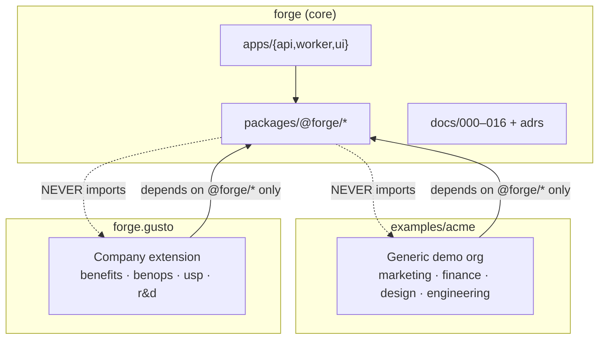
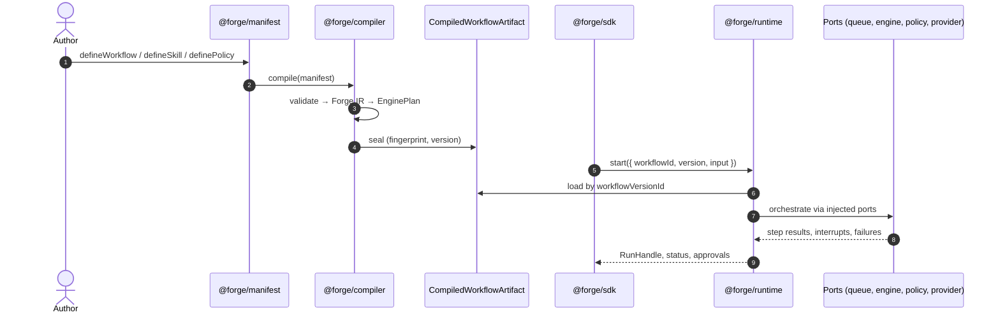

# 000 — Forge Overview

**Status:** Normative (Phase 0 handbook)  
**Audience:** Principal engineers, implementation agents, platform architects  
**Last updated:** 2026-08-02  
**Related:** [001-vision](./001-vision.md) · [003-project-constitution](./003-project-constitution.md) · [004-architecture](./004-architecture.md) · [005-research-workflow](./005-research-workflow.md) · [MASTER_SPEC](./MASTER_SPEC.md) *(planned)*

---

## Purpose

This document is the **entry point** to the Forge principal-engineer handbook. It defines what Forge is, what it is not, how the repository is organized, and how the numbered specification documents fit together. Every human or AI agent that implements Forge must read this document first, then follow the linked specs in order before writing production code.

Forge is not a README substitute. It is a **versioned engineering specification**—the canonical reference for architecture, standards, phases, acceptance criteria, and quality gates. If a decision is not recorded here or in a linked ADR, it is not decided.

---

## Non-goals

This overview does **not**:

- Replace detailed specs (`004`–`016`) or ADRs under `docs/adrs/`.
- Describe implementation details of individual packages (see `006`–`014`).
- Serve as API documentation for `@forge/sdk` (generated from code when packages exist).
- Authorize skipping Phase 0 research or the constitution in [003](./003-project-constitution.md).
- Define company-specific business rules (those live in `forge.gusto` and `examples/acme` only).

---

## Product definition

**Forge** is a typed AI workflow runtime that **compiles** manifests, plugins, skills, and policies into deterministic infrastructure with intelligent execution. Organizations **extend** Forge; they never fork it. **Humans approve; AI recommends.**

Concretely:

| Layer | What it does |
|-------|----------------|
| **Authoring** | Typed manifests (`defineWorkflow`, `definePrompt`, `defineSkill`, `definePolicy`) validated with Zod v4 |
| **Compiler** | Pure lowering: Manifest → **Forge IR** → opaque **EnginePlan** (see [004](./004-architecture.md), `007-workflow-compiler.md`) |
| **Runtime** | Stateful orchestration over ports: queue, graph engine, checkpoint, provider, policy, observability |
| **Extension** | Company packages contribute domain workflows without modifying core |

The public surface speaks **Forge types exclusively**. LangGraph, BullMQ, Claude, ACPX, and `@simpill/acp-llm-cli` exist only inside private adapter packages ([ADR-002](./adrs/002-workflow-engine.md), [ADR-004](./adrs/004-queue.md), [ADR-005](./adrs/005-provider.md)).

---

## Identity principles

These principles are Forge's **philosophy**, not optional guidance. They appear in every spec and ADR.

| # | Principle | One-line meaning |
|---|-----------|------------------|
| 1 | **Compile. Don't Configure.** | Workflows are compiled into the engine; authors never hand-wire graphs |
| 2 | **Deterministic Infrastructure. Intelligent Execution.** | Everything that can be deterministic should be; LLMs fill uncertainty |
| 3 | **Extension over Replacement.** | Organizations never fork Forge; they ship company packages |
| 4 | **Adapters at Every Boundary.** | Nothing outside Forge leaks into the core |
| 5 | **Prompts are Versioned Assets.** | Prompts are typed, semver'd artifacts—not inline strings |
| 6 | **Policies before Permissions.** | Capabilities determine what is allowed; prompts never authorize |
| 7 | **Humans own the final decision.** | AI recommends; humans approve side effects |
| 8 | **Research before Implementation.** | Significant features begin with research, ADRs, and benchmarks—not coding |

Full normative rules live in [003-project-constitution.md](./003-project-constitution.md).

---

## Repository topology

Three artifacts share one runtime. Dependency direction is **non-negotiable**.

| Artifact | Role | Location |
|----------|------|----------|
| **`forge`** | Core runtime, compiler, ports, adapters, public SDK | `packages/@forge/*`, `apps/*` |
| **`examples/acme`** | Living **generic** demo organization | `examples/acme/` |
| **`forge.gusto`** | **Company extension** package (Gusto-shaped) | `forge.gusto/` (sibling to core workspace) |

**Rule:** `forge` never depends on `forge.gusto` or `examples/*`. Architecture tests ([ADR-001](./adrs/001-monorepo-layout.md)) must fail on violation.

---

## Handbook map

The handbook is a numbered series. Read in order for greenfield implementation; jump by topic for maintenance.

| Doc | Title | Primary content |
|-----|-------|-----------------|
| **000** | Overview | *This document* — product, principles, repo map |
| **001** | Vision | North star, success criteria, long-term direction |
| **002** | Problem statement | Why Forge exists; pain points; non-goals |
| **003** | Project constitution | Never-violate engineering standards; what-not-to-build |
| **004** | Architecture | Hexagonal layers, package map, monorepo layout |
| **005** | Research workflow | Phase 0 process; ADR requirements; quality gates |
| **006** | Runtime | Run lifecycle, ports, queue vs engine retry, approvals |
| **007** | Workflow compiler | Manifest → IR → EnginePlan; diagnostics |
| **008** | Provider SDK | `ProviderPort`, `@simpill/acp-llm-cli`, mock provider |
| **009** | Plugin SDK | Company packages, registries, capability model |
| **010** | Sandbox | `SandboxPort`, worktrees, Docker, Testcontainers |
| **011** | Observability | OpenTelemetry, LangSmith adapter, structured logging |
| **012** | UI | Operator console, approvals, run inspector |
| **013** | Testing | Unit, integration, architecture, demo acceptance |
| **014** | Security | Threat model, OPA Wasm, secrets, CSP |
| **015** | Phases | Phase 0–production deliverables, demos, exit criteria |
| **016** | Demo scenarios | Acme A1–A5, Gusto G1–G5 acceptance scripts |

**ADRs** (`docs/adrs/`) record binding technology decisions:

| ADR | Decision |
|-----|----------|
| [ADR-001](./adrs/001-monorepo-layout.md) | pnpm workspace; core vs company vs examples layout |
| [ADR-002](./adrs/002-workflow-engine.md) | LangGraph behind `GraphEnginePort`; opaque `EnginePlan` |
| [ADR-003](./adrs/003-sandbox.md) | Docker + worktrees MVP; Testcontainers CI; microVM later |
| [ADR-004](./adrs/004-queue.md) | BullMQ behind `QueuePort`; no lock during human wait |
| [ADR-005](./adrs/005-provider.md) | `@simpill/acp-llm-cli` as provider harness |
| [ADR-006](./adrs/006-observability.md) | OpenTelemetry substrate; LangSmith optional |
| [ADR-007](./adrs/007-policy.md) | OPA Wasm `PolicyPort`; OpenFeature for flags only |

Research notes under `docs/research/` are **inputs** to specs and ADRs, not normative on their own.

---

## End-to-end data flow

Authors write manifests. The compiler produces sealed artifacts. The runtime executes through ports. Operators and integrators use `@forge/sdk` only.

---

## Two proof points

Forge must demonstrate the same claim twice:

### Acme — generic framework

`examples/acme` proves that **any organization shape** can run on Forge without company-specific code in core:

- **Marketing:** campaign brief → draft → human approve → publish request
- **Finance:** invoice anomaly review; recommendation ≠ authorization
- **Design:** brand checklist; read-only capabilities
- **Engineering:** PR risk summary; merge gated by approval

See [016-demo-scenarios.md](./016-demo-scenarios.md) scenarios A1–A5.

### Gusto — real company customization

`forge.gusto` proves that a **production-shaped company** extends Forge via manifests, plugins, policies, and adapters—without forking:

- **Benefits:** member inquiry with regulated-topic escalation
- **BenOps:** ticket triage → runbook → gated execution
- **USP:** narrative pack with brand/legal approval
- **R&D:** sandbox isolation; prod adapters denied

See scenarios G1–G5 in [016](./016-demo-scenarios.md).

**Parity demo (G5):** One Forge installation runs Acme marketing and Gusto BenOps by swapping company package only.

---

## Normative rules (overview-level)

These rules are expanded in [003](./003-project-constitution.md) and [004](./004-architecture.md):

1. **Strong TypeScript** — no `any`; branded IDs; exhaustive unions.
2. **Zod v4 at every process boundary** — HTTP, queue payloads, sandbox IPC, manifest load.
3. **Ports & adapters** — domain never imports vendor packages.
4. **Composition roots only** — `apps/api`, `apps/worker`, tests wire adapters; no service locator in domain.
5. **Env for secrets; config for everything else** — no org IDs in core source.
6. **Version everything** — workflows, prompts, skills, policies, compiler, artifacts.
7. **Human approval gates** — durable `AWAITING_APPROVAL`; worker releases queue lock during human time ([ADR-004](./adrs/004-queue.md)).
8. **Policy before side effects** — OPA Wasm evaluates capabilities; fail closed ([ADR-007](./adrs/007-policy.md)).
9. **Research before implementation** — Phase 0 produces ADRs before Phase 1 code ([005](./005-research-workflow.md)).

---

## Phase model (summary)

Every implementation phase ends with four sections: **Deliverables**, **Demo**, **Quality Gates**, **Exit Criteria**. Full detail in `015-phases.md`.

| Phase | Focus | Exit signal |
|-------|-------|-------------|
| **0** | Research & specification only | ADRs accepted; handbook reviewable; **no production code** |
| **1** | Monorepo + constitution tooling | Workspace boots; architecture tests enforce boundaries |
| **2** | Provider + sandbox + compiler skeleton | Two providers; resume workflow |
| **3** | Plugin SDK + company loader | Acme company package loads |
| **4** | Policies + approvals | Finance/marketing approval paths green |
| **5** | Acme full demo suite | A1–A5 acceptance |
| **6** | `forge.gusto` + G1–G2 | Benefits + BenOps demos |
| **7+** | USP, R&D, UI, hardening | Per `015` |

**Phase 0 is research-only.** Forge dogfoods its own research-first workflow from day one.

---

## Rationale

### Why a handbook before code?

Implementation agents (human or AI) produce higher-quality output when constraints, acceptance criteria, and forbidden patterns are explicit. A 150–250 page specification reduces accidental architecture, vendor leaks, and fork pressure. RAW establishes this as the **first artifact**, not an afterthought.

### Why three-repo-artifacts, one runtime?

Separating core, generic demo, and company extension proves **Extension over Replacement** is real—not documentation theater. If Gusto logic appears in `packages/@forge/*`, the model failed.

### Why opaque EnginePlan?

Swapping LangGraph, adding a second engine for experiments, or testing the compiler without Redis all require **engine-agnostic IR** and an opaque plan brand ([ADR-002](./adrs/002-workflow-engine.md)). Public consumers never see graph structure.

---

## Alternatives considered

| Alternative | Why rejected |
|-------------|--------------|
| README + inline comments only | Insufficient for agents; no quality gates |
| Single monolithic spec file | Unmaintainable at 150+ pages; poor ownership |
| Fork-per-company customization | Violates Extension over Replacement; unmaintainable |
| Public LangGraph/BullMQ APIs | Violates Adapters at Every Boundary; couples consumers |
| Skip Phase 0; start coding | Produces accidental ADRs; violates Research before Implementation |

---

## Acceptance criteria

Phase 0 is complete for **this document** when:

- [ ] A new principal engineer can explain Forge's purpose, three-artifact model, and eight principles in five minutes.
- [ ] An implementation agent can navigate from `000` to the correct deep spec for any topic in the handbook map.
- [ ] Dependency direction (core ↛ company ↛ examples) is diagrammed and matches [ADR-001](./adrs/001-monorepo-layout.md).
- [ ] All ADR-001 through ADR-007 are linked and summarized.
- [ ] Acme and Gusto proof points are named with scenario IDs (A1–A5, G1–G5).
- [ ] No normative statement in `000` contradicts [003](./003-project-constitution.md) or [004](./004-architecture.md).

---

## Document maintenance

| Event | Action |
|-------|--------|
| New ADR accepted | Update handbook map and ADR table in `000` |
| Phase boundary change | Update phase summary; detail in `015` |
| New public package | Update [004](./004-architecture.md) package map |
| Principle amendment | Requires explicit ADR or constitution revision in `003` |

**Owner:** Forge architecture working group.  
**Review cadence:** End of each phase; mandatory before Phase 1 merge.

---

## Quick reference for implementation agents

Before writing code:

1. Read **000** (this doc), **003** (constitution), **004** (architecture), **005** (research workflow).
2. Confirm the feature has an **accepted ADR** or is explicitly deferred.
3. Confirm the change does not violate the **what-not-to-build** list in **003**.
4. Identify the **phase** in `015` and its exit criteria.
5. If adding a demo, map to **016** scenario or propose a new one with acceptance checklist.

When in doubt: **research → ADR → spec update → implement → test → demo.**
