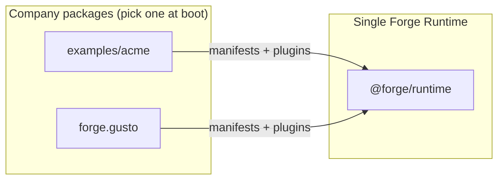

# 001 — Vision

**Status:** Normative (Phase 0 handbook)  
**Audience:** Leadership, principal engineers, implementation agents  
**Last updated:** 2026-08-02  
**Related:** [000-overview](./000-overview.md) · [002-problem-statement](./002-problem-statement.md) · [003-project-constitution](./003-project-constitution.md) · [016-demo-scenarios](./016-demo-scenarios.md)

---

## Purpose

This document states Forge's **north star**: the future we are building toward, the outcomes that define success, and the boundaries that keep the project coherent over years of extension. Vision is intentionally aspirational but **testable**—every claim maps to demo scenarios, phase exit criteria, or constitution rules.

---

## Non-goals

Vision does **not**:

- Specify package APIs or file layouts (see [004-architecture](./004-architecture.md)).
- Replace the problem statement in [002](./002-problem-statement.md).
- Commit to dates or headcount.
- Promise features not backed by a phase in `015-phases.md`.
- Describe Gusto-specific business outcomes as core product requirements.

---

## North star statement

> **Forge is the typed runtime where organizations compile AI workflows into deterministic, policy-gated, human-approved automation—extending the platform without forking it.**

In ten years, an engineer joining a company that uses Forge should find:

- **One runtime** executing marketing campaigns, benefits inquiries, and R&D experiments.
- **Company packages** (`forge.gusto`, future `forge.<org>`) containing domain logic—not forks of core.
- **Audit trails** showing policy decisions, prompt versions, and human approvals—not model rationales masquerading as authorization.
- **Swappable infrastructure** (queue, engine, provider, sandbox) behind ports, upgraded without rewriting workflows.

---

## What success looks like

### For platform engineers

| Success criterion | How we know |
|-------------------|-------------|
| Zero vendor types in public SDK | Architecture tests; `@forge/sdk` dependency graph |
| Compiler is pure and testable | Unit tests with no Redis/LLM/network |
| Same workflow runs on mock and Claude | DI swap only ([ADR-005](./adrs/005-provider.md)) |
| Kill worker during approval; resume later | Scenario A4, G2 acceptance |
| Company package loads without core changes | Acme + Gusto parity demo (G5) |

### For company extenders

| Success criterion | How we know |
|-------------------|-------------|
| Ship workflows without forking | `forge.gusto` depends on `@forge/*` only |
| Policies gate side effects | Finance (A2), Benefits (G1) demos |
| Prompts are versioned assets | Audit log includes prompt asset IDs |
| Config refs, not hardcoded IDs | No Slack channel literals in core |

### For operators and humans-in-the-loop

| Success criterion | How we know |
|-------------------|-------------|
| Approvals are durable states | `AWAITING_APPROVAL` survives worker restart |
| AI output is recommendation, not authority | Policy log ≠ model output in A2 |
| Run inspector shows Forge concepts | Run, gate, capability—not LangGraph state keys |
| Telemetry explains failures | OTel spans + structured error codes ([ADR-006](./adrs/006-observability.md)) |

---

## Strategic pillars

### Pillar 1: Compile, don't configure

Workflow authors declare **what** should happen in typed manifests. The compiler lowers manifests to Forge IR and an opaque EnginePlan. No author imports LangGraph, constructs `StateGraph`, or hand-wires BullMQ queues.

**Vision outcome:** Adding a step to a workflow is a manifest change + recompile—not a refactor across runtime, UI, and queue wiring.

### Pillar 2: Deterministic infrastructure, intelligent execution

Deterministic layers:

- Schema validation (Zod v4)
- Policy evaluation (OPA Wasm, fail closed)
- Branch/transform nodes
- Retry/backoff/timeout policies declared in IR
- Queue delivery, checkpoint persistence, idempotency keys

Intelligent layers:

- Agent nodes via `ProviderPort`
- Classification, drafting, triage skills
- Recommendations attached to approval payloads

**Vision outcome:** Incidents are debugged from spans and error codes, not from "the model did something unexpected" as root cause for authorization failures.

### Pillar 3: Extension over replacement

Organizations ship **company packages**:

```
forge.gusto/
  forge.company.json
  domains/{benefits,benops,usp,r-and-d}/
  plugins/ · workflows/ · skills/ · policies/ · prompts/ · adapters/
```

Core provides compile path, plugin loader, capability model, approval protocol, and ports. Gusto never merges Benefits logic into `@forge/runtime`.

**Vision outcome:** A second company (`forge.acme-corp`) is a new package, not a second Git fork.

### Pillar 4: Adapters at every boundary

Every external system crosses a port:

| Port | Example adapters (internal only) |
|------|----------------------------------|
| `GraphEnginePort` | LangGraph ([ADR-002](./adrs/002-workflow-engine.md)) |
| `QueuePort` | BullMQ ([ADR-004](./adrs/004-queue.md)) |
| `ProviderPort` | `@simpill/acp-llm-cli`, mock ([ADR-005](./adrs/005-provider.md)) |
| `PolicyPort` | OPA Wasm ([ADR-007](./adrs/007-policy.md)) |
| `ObservabilityPort` | OpenTelemetry, LangSmith ([ADR-006](./adrs/006-observability.md)) |
| `SandboxPort` | Docker, Testcontainers ([ADR-003](./adrs/003-sandbox.md)) |

**Vision outcome:** Replacing BullMQ with another transport is an adapter swap, not a SDK breaking change.

### Pillar 5: Prompts are versioned assets

Prompts live in registries with semver, immutable IDs, and Zod schemas. Workflows reference `promptRefs[]`; compiler resolves and binds at compile time. Inline prompt strings in application code are forbidden.

**Vision outcome:** Prompt rollback is `promptRef` version pin + recompile—not a production hotfix of string literals.

### Pillar 6: Policies before permissions

Authorization flows:

```
Request(action, resource, actor, context)
  → PolicyPort.evaluate(policyPacks)
  → Allow | Deny | RequireApproval
```

Prompts may explain recommendations. They **never** grant capabilities. OpenFeature controls rollout flags only—not authz ([ADR-007](./adrs/007-policy.md)).

**Vision outcome:** Security review focuses on policy packs and capability closure, not prompt red-teaming alone.

### Pillar 7: Humans own the final decision

Agent nodes produce typed recommendations. Approval gates interrupt execution, persist checkpoint, release worker locks, and wait for authenticated human decisions. Providers cannot call `decideApproval`.

**Vision outcome:** Regulated domains (benefits, finance, external publish) default to **RequireApproval**; demos prove reject paths leave zero side effects.

### Pillar 8: Research before implementation

Forge uses the workflow it automates: Research → ADR → Benchmark → Decision Matrix → Prototype → Tests → Implementation ([005-research-workflow](./005-research-workflow.md)). Phase 0 produces the handbook and ADRs before Phase 1 code.

**Vision outcome:** Every technology in `PACKAGE-EVIDENCE.md` has a documented adopt/reject rationale—not "it was in the tutorial."

---

## The living demo organization

Vision includes **demonstrable proof**, not slideware.

### Acme (`examples/acme`)

Generic departments—marketing, finance, design, engineering—prove the framework works for arbitrary org shapes. Acme uses mock adapters and fixture data. It is **configuration + plugins**, not a second runtime.

### Gusto (`forge.gusto`)

Real company domains—benefits, benops, usp, r&d—prove production-shaped customization: PII policies, benefits-data rules, research-sandbox isolation, multi-policy packs.



**Vision outcome:** A principal engineer evaluating Forge runs `forge run --company acme --workflow marketing.campaign-brief` and `forge run --company gusto --workflow benops.ticket-triage` on the **same binary**.

---

## Long-term direction (non-binding horizons)

These are directional, not Phase 1 commitments:

| Horizon | Direction |
|---------|-----------|
| **Multi-company hosting** | Tenant-scoped queues, policy packs, artifact caches |
| **Plugin marketplace** | Signed plugins, capability sandboxing, semver compatibility |
| **MCP tool surface** | Tools behind policy + sandbox ([PACKAGE-EVIDENCE](./research/PACKAGE-EVIDENCE.md) ADOPT-LATER) |
| **Managed sandboxes** | Firecracker-class microVMs for untrusted code ([ADR-003](./adrs/003-sandbox.md)) |
| **Judge architecture** | Typed evaluators for quality gates on agent outputs |
| **Operator UI** | Approvals, run inspector, policy decision viewer |

Each horizon requires ADR before implementation.

---

## Normative rules (vision-derived)

1. Public API surface remains **Forge-native** (Workflow, Run, Approval, Capability)—never vendor-native.
2. Company business nouns (member, claim, benops ticket) **never** appear in `@forge/types`.
3. Every phase ships a **demo** that proves at least one pillar.
4. Feature work without vision alignment is out of scope until ADR resolves tension.
5. Dogfooding: Forge's own delivery follows research-first workflow.

---

## Rationale

### Why "compile" not "configure"?

Hand-wired graphs encode execution order in imperative code scattered across services. Manifests centralize structure; the compiler validates completeness, policy hooks, and capability closure **before** runtime. This matches how mature platforms treat infrastructure (Terraform, compilers)—not one-off scripts.

### Why extension packages?

Forks diverge. Security patches, port upgrades, and compiler fixes must flow to all organizations. A package boundary with semver is the industry-proven model (Kubernetes operators, VS Code extensions, Terraform modules).

### Why human approval as first-class?

Agent reliability is insufficient for side effects in regulated domains. Interrupt-based HITL that releases worker resources during human latency is an **architecture requirement**, not a UI nice-to-have ([ADR-004](./adrs/004-queue.md)).

---

## Alternatives considered

| Alternative vision | Why rejected |
|--------------------|--------------|
| "Best LangGraph wrapper" | Commoditized; leaks vendor; no policy/HITL story |
| "Prompt orchestration platform" | Conflates authorization with text; fails regulated use cases |
| "Single-tenant Gusto automation tool" | Not reusable; violates extension model |
| "Autonomous agents with tool use" | Without policy/HITL, fails audit and safety bars |
| "Documentation later" | Agents ship wrong architecture; rework cost exceeds spec cost |

---

## Anti-vision (what we refuse to become)

- A prompt playground where anyone can paste system prompts and call it a workflow.
- A repo Gusto forks and maintains separately from upstream.
- A thin re-export of LangGraph + BullMQ with Forge branding.
- A system where the model's suggestion automatically triggers Slack posts, payments, or member messages.
- A codebase where `grep langgraph packages/sdk` returns hits.

These are constitution violations ([003](./003-project-constitution.md)).

---

## Acceptance criteria

Vision document is **accepted** when:

- [ ] All eight pillars are named and mapped to at least one demo scenario or ADR.
- [ ] Success criteria tables are testable (not subjective adjectives).
- [ ] Acme and Gusto roles are distinct and match [000-overview](./000-overview.md).
- [ ] Long-term horizons are marked non-binding and ADR-gated.
- [ ] Anti-vision list aligns with what-not-to-build in **003**.
- [ ] Stakeholder can answer: "Why not just use LangGraph directly?" in one paragraph (Adapters + Compile + Policy + HITL).

---

## Relationship to other documents

| Question | Read |
|----------|------|
| What pain are we solving? | [002-problem-statement](./002-problem-statement.md) |
| What must never be violated? | [003-project-constitution](./003-project-constitution.md) |
| How is it built? | [004-architecture](./004-architecture.md) |
| How do we decide technologies? | [005-research-workflow](./005-research-workflow.md) |
| What demos prove the vision? | [016-demo-scenarios](./016-demo-scenarios.md) |
| When is it done? | [015-phases](./015-phases.md) |

---

## Closing

Forge succeeds when a skeptical principal engineer watches Acme marketing and Gusto BenOps run on one runtime, inspects a policy deny log that no prompt could override, and resumes a workflow days after an approval—without seeing LangGraph, BullMQ, or Claude types in any public import.

That is the bar. Everything in this handbook exists to make that demo boringly reliable.
