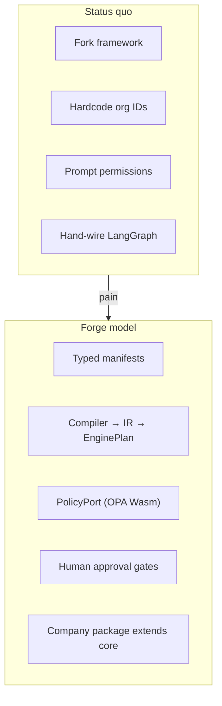

# 002 — Problem Statement

**Status:** Normative (Phase 0 handbook)  
**Audience:** Principal engineers, security reviewers, implementation agents  
**Last updated:** 2026-08-02  
**Related:** [001-vision](./001-vision.md) · [003-project-constitution](./003-project-constitution.md) · [009-plugin-sdk](./009-plugin-sdk.md) · [016-demo-scenarios](./016-demo-scenarios.md)

---

## Purpose

This document defines **why Forge exists**: the organizational and technical failures in current AI workflow adoption, the constraints a solution must satisfy, and explicit **non-goals** that prevent scope creep. Implementation agents use this document to reject features that solve the wrong problem.

---

## Non-goals (product scope)

Forge is **not**:

| Non-goal | Rationale |
|----------|-----------|
| A prompt playground | Prompts are versioned assets inside compiled workflows, not ad-hoc chat |
| A LangGraph wrapper with rebranding | Violates Adapters at Every Boundary; couples consumers to vendor |
| A per-company fork model | Violates Extension over Replacement |
| An "agent can do anything the model asks" system | Violates Policies before Permissions |
| A replacement for Jira, Slack, or Gusto internal tools | Forge orchestrates; adapters integrate |
| A general-purpose LLM gateway | Provider is one port among many |
| A no-code UI for arbitrary graph editing | Authors write typed manifests; compile lowers to engine |
| A research paper or benchmark suite | Research informs ADRs; product is the runtime |

---

## The problem

Organizations adopting AI workflows today face a convergent set of failures:

### 1. Fork pressure

Teams copy an upstream framework repo, embed company-specific logic (Slack channels, Jira projects, benefits rules), and maintain a divergent fork. Security patches and architectural improvements from upstream never merge cleanly. Each company repeats the same adapter work.

**Symptom:** `grep -r "gusto" upstream/packages` returns hits after "customization."

### 2. Prompt-as-permission

Capabilities are implied by prompt text: "You may post to Slack if appropriate." Models interpret "appropriate" inconsistently. Red-teaming prompts replaces auditing authorization logic.

**Symptom:** Incident postmortems cite "the model decided to" for actions that should require policy and human approval.

### 3. Hand-wired orchestration

Workflows are imperative code: direct LangGraph construction, inline queue calls, scattered retry logic. Changing a step requires touching runtime, worker, and UI. Testing requires full infrastructure.

**Symptom:** No single artifact represents "the workflow"; diffing versions means reading TypeScript across packages.

### 4. Vendor leakage

Public SDKs re-export LangGraph types, BullMQ jobs, or Claude request shapes. Consumers become coupled to vendor upgrade cycles and semantics (interrupts, checkpoints, model IDs).

**Symptom:** Breaking LangGraph minor version breaks company integrations.

### 5. Fragile human-in-the-loop

Approvals are callbacks, in-memory waits, or engine interrupts exposed raw to UI. Workers hold queue locks across human latency (hours/days). Restarts lose state.

**Symptom:** "Don't deploy during approval season" because workers are tied up.

### 6. Untyped boundaries

JSON blobs cross HTTP, queue, and sandbox boundaries without schema validation. Magic strings identify workflows, channels, and steps. Failures surface late at runtime.

**Symptom:** Production errors are `undefined is not a function` instead of `WF_UNKNOWN_REF`.

### 7. Non-deterministic infrastructure

Retry, timeout, rate limit, and idempotency behavior vary by copy-paste across services. Observability is printf debugging. Feature flags double as authorization.

**Symptom:** Cannot answer "why was this action allowed?" from logs alone.

---

## Who is affected

| Persona | Pain today | Forge obligation |
|---------|------------|------------------|
| **Platform engineer** | Maintains forks; upgrades break consumers | Ports, semver public SDK, architecture tests |
| **Domain engineer (Benefits, Marketing)** | Waits on platform for every workflow change | Typed manifests + company package |
| **Security / compliance** | Cannot audit prompt-only guardrails | OPA Wasm policy packs, approval records |
| **Operator / approver** | Unclear what AI recommends vs what executes | Typed approval payloads; side effects gated |
| **Implementation agent (AI)** | Guesses architecture; leaks vendors | Handbook + constitution + ADRs |

---

## Forge's answer

Forge is a **compile-time, typed, policy-gated runtime**. Companies ship **packages of manifests, plugins, skills, and policies**. The same runtime executes Acme marketing and Gusto BenOps without forking.

### Mechanism summary

| Problem | Forge mechanism | Principle |
|---------|-----------------|-----------|
| Fork pressure | `forge.gusto` company package | Extension over Replacement |
| Prompt-as-permission | `PolicyPort` + capability model | Policies before Permissions |
| Hand-wired graphs | Manifest → IR → EnginePlan | Compile. Don't Configure. |
| Vendor leakage | Adapters; opaque EnginePlan | Adapters at Every Boundary |
| Fragile HITL | Durable approvals; queue ack on wait | Humans own the final decision |
| Untyped boundaries | Zod v4 safeParse everywhere | Constitution |
| Non-deterministic infra | IR node policies; OTel; structured errors | Deterministic Infrastructure |

---

## Requirements (derived)

These are **must-satisfy** requirements for any Forge release claiming to solve the problem:

### R1 — Extension without fork

- Core (`forge`) contains zero company business rules.
- `forge.gusto` and `examples/acme` depend on `@forge/*` only.
- Architecture tests fail if core imports company or example packages ([ADR-001](./adrs/001-monorepo-layout.md)).

### R2 — Compile-time validation

- Workflow, skill, policy, and prompt artifacts validate at load/compile time.
- Compiler is pure: no network, no LLM, no Redis ([004-architecture](./004-architecture.md)).
- Diagnostics use stable error codes.

### R3 — Authorization outside prompts

- Every privileged action passes `PolicyPort.evaluate`.
- Fail closed on policy errors ([ADR-007](./adrs/007-policy.md)).
- Demos A2, G1 prove prompt cannot grant denied capability.

### R4 — Durable human gates

- Approval states persist across worker restarts.
- Workers release queue locks during human wait ([ADR-004](./adrs/004-queue.md)).
- Resume is typed and idempotent.

### R5 — Public/vendor separation

- `@forge/sdk`, `@forge/manifest`, `@forge/types`, `@forge/plugin-sdk` have zero vendor engine dependencies.
- Never expose LangGraph, BullMQ, Claude, ACPX, `@simpill/acp-llm-cli` publicly.

### R6 — Observable accountability

- Runs emit OTel spans with workflow version, policy pack version, prompt asset IDs ([ADR-006](./adrs/006-observability.md)).
- Audit trail answers: who approved, under which policy, which prompt versions.

### R7 — Same runtime, different companies

- Parity demo: Acme + Gusto on one process (G5).
- Switching company package does not require core rebuild.

---

## Problem scenarios (concrete)

### Scenario: Benefits member message

**Today:** Agent drafts reply; script posts to member portal if model outputs `"send": true`.

**Failure modes:**
- Model hallucinates send on regulated topic
- No approver record
- Cannot replay which prompt version was used

**Forge:** Workflow `benefits.member-inquiry` → policy `benefits.advice.regulated` → RequireApproval → side effect only after human decision (G1).

### Scenario: Marketing publish

**Today:** LangGraph graph hardcoded with Slack channel `#launch-2024-q3`.

**Failure modes:**
- Channel rename breaks workflow
- Gusto cannot reuse Acme graph
- Graph logic in core repo

**Forge:** Config ref `acme.marketing.launch-channel` in company manifest; compile from manifest (A1).

### Scenario: Finance payment

**Today:** "Recommend payment" and "initiate payment" in same agent turn.

**Failure modes:** Operator cannot distinguish recommendation from execution.

**Forge:** Policy `finance.payment.initiate` always RequireApproval; recommendation in typed field only (A2).

### Scenario: R&D experiment

**Today:** Research agent has production API keys via shared env.

**Failure modes:** Experiment triggers prod side effect.

**Forge:** Domain `r-and-d` policy pack denies prod adapter bindings (G4).

---

## Normative rules

1. **No company nouns in core** — `MemberId`, `ClaimType` live in `forge.gusto`, not `@forge/types`.
2. **No hardcoded org identifiers in core** — channels, repos, Jira projects are config refs in company packages.
3. **Side effects declared** — compiler enforces gates on declared `sideEffects[]`.
4. **Skills request capabilities; policies grant** — closure check before compile.
5. **Secrets in env only** — never in manifests or committed config.
6. **Research precedes build** — problem-solution fit validated in Phase 0 ([005](./005-research-workflow.md)).

---

## Rationale

### Why not fix prompts?

Prompts control **language**, not **authorization**. Regulated domains require deterministic, testable, versioned policy evaluation. OPA Wasm policy packs are auditable; prompt tweaks are not.

### Why not "just use LangGraph"?

LangGraph solves graph execution—not company extension, policy-gated side effects, opaque public APIs, or compile-time capability closure. Forge **uses** LangGraph internally ([ADR-002](./adrs/002-workflow-engine.md)) without **being** LangGraph.

### Why company packages?

The problem is organizational: multiple domains need different workflows on shared infrastructure. Package extension is the smallest unit that enables semver, independent release, and import boundary enforcement.

---

## Alternatives considered

| Alternative | Assessment |
|-------------|------------|
| **Buy SaaS agent platform** | Black box; fork pressure moves to vendor lock-in |
| **Internal scripts + Claude API** | No compile, policy, or HITL; does not scale |
| **Temporal + raw LLM calls** | Heavier ops; still need IR, policy, company model |
| **Monorepo with `if (company === 'gusto')`** | Violates extension model; untestable matrix |
| **Open-source LangGraph templates per vertical** | Fork model; no shared runtime guarantees |

---

## Acceptance criteria

Problem statement is **accepted** when:

- [ ] All seven failure themes are named with symptoms.
- [ ] Requirements R1–R7 are testable and map to demos or ADRs.
- [ ] Non-goals table prevents common scope creep requests.
- [ ] Four concrete scenarios (benefits, marketing, finance, R&D) show before/after.
- [ ] No requirement contradicts [003-project-constitution](./003-project-constitution.md).
- [ ] Stakeholder agrees: "If we ship G5 and A2 green, we've solved the stated problem for v1."

---

## Success metrics (v1)

| Metric | Target |
|--------|--------|
| Core import of company code | 0 violations (CI) |
| Public package vendor deps | 0 |
| Workflows with inline prompts in core | 0 |
| Demo scenarios A1–A2, G1, G5 | Passing acceptance |
| Policy deny without prompt override | Demonstrated in CI |
| Approval resume after worker kill | Demonstrated in CI |

Detailed demo checklists: [016-demo-scenarios](./016-demo-scenarios.md).

---

## Open questions (Phase 0)

These affect problem depth but not the core thesis:

1. **USP domain naming** — org unit vs product narrative (Gusto); blocks workflow nouns only.
2. **Multi-approver quorum** — v1 or later for HITL.
3. **Hot-reload company packages** — ops model vs process restart.
4. **OSS scope of Acme** — full examples public vs trimmed.

Resolve via ADR before Phase 6 (`forge.gusto` heavy demos).

---

## Summary

Organizations need AI workflow automation that is **typed, compiled, policy-gated, human-approved, and extended—not forked**. Current approaches fail on authorization, durability, vendor coupling, and maintainability. Forge addresses these with a hexagonal TypeScript runtime, company packages, and a research-first delivery process. Anything that does not advance R1–R7 is out of scope.
