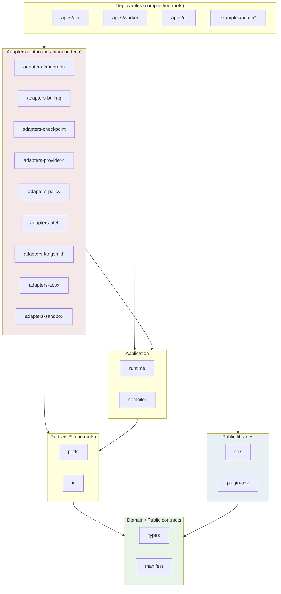
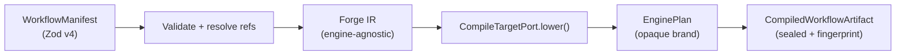
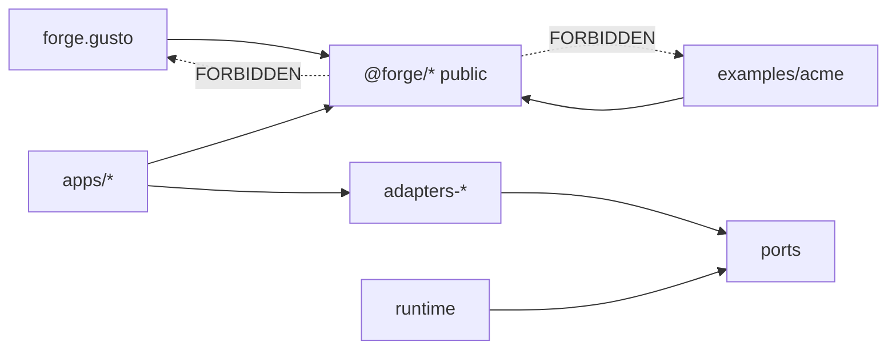
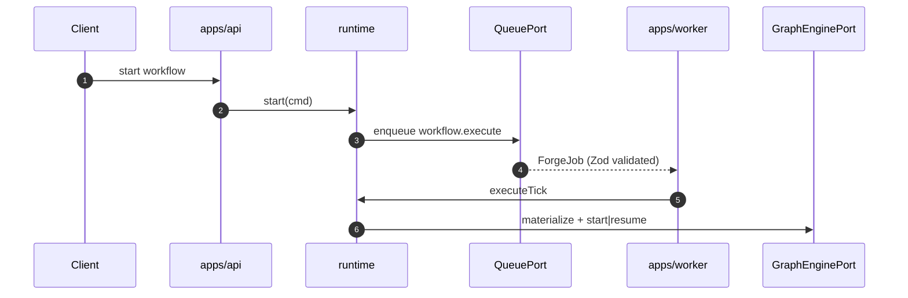

# 004 — Architecture

**Status:** Normative (Phase 0 handbook)  
**Audience:** Principal engineers, implementation agents  
**Last updated:** 2026-08-02  
**Related:** [003-project-constitution](./003-project-constitution.md) · [006-runtime](./006-runtime.md) · [007-workflow-compiler](./007-workflow-compiler.md) · [ADR-001](./adrs/001-monorepo-layout.md)

---

## Purpose

This document defines Forge's **system architecture**: hexagonal layering, package map, monorepo layout, dependency rules, composition/DI policy, and architecture fitness gates. It is the authoritative reference for where code lives and which imports are legal.

---

## Non-goals

This document does **not**:

- Specify runtime state machines in full (see [006-runtime](./006-runtime.md)).
- Define manifest schema field-by-field (see [007-workflow-compiler](./007-workflow-compiler.md)).
- Document company plugin APIs (see [009-plugin-sdk](./009-plugin-sdk.md)).
- Replace ADRs for individual technology choices.

---

## Architectural verdict

Forge is a **hexagonal TypeScript monorepo** with three hard seams:

1. **Authoring surface** — typed manifests (workflows, prompts, skills, policies).
2. **Compiler** — pure, deterministic lowering: **Manifest → Forge IR → opaque EnginePlan**.
3. **Runtime** — stateful orchestration over ports: queue, graph engine, checkpoint, provider, policy, observability.

LangGraph, BullMQ, Claude, ACPX, and `@simpill/acp-llm-cli` exist **only** inside adapter packages. The public SDK speaks Forge types exclusively.

---

## Layer model

Dependencies point **inward**. Adapters implement ports; ports never depend on adapters. Public packages never depend on adapter or vendor packages.



### Layer responsibilities

| Layer | Packages | May import | Must not import |
|-------|----------|------------|-----------------|
| **Public** | `sdk`, `manifest`, `types`, `plugin-sdk` | `types`, `manifest` (sdk); `types` only preferred for plugin-sdk | `runtime`, `compiler`, `ir`, `adapters-*`, vendors |
| **Domain** | `types`, `manifest` | Shared primitives only | Application, adapters |
| **Contracts** | `ports`, `ir` | `types` | Adapters, vendors |
| **Application** | `compiler`, `runtime` | `ports`, `ir`, `manifest`, `types` | Concrete adapters (use ports) |
| **Adapters** | `adapters-*` | `ports`, vendor libs | Must not be imported by public |
| **Deployables** | `apps/*`, `examples/*` | All of the above for wiring | N/A (roots) |

---

## Compile pipeline

**Compile. Don't Configure.** Authors never hand-wire LangGraph.



| Stage | Owner | Deterministic? |
|-------|-------|----------------|
| Manifest validation | `@forge/compiler` | Yes |
| IR construction | `@forge/compiler` | Yes |
| IR → EnginePlan | `@forge/adapters-langgraph` | Yes (given IR + adapter version) |
| Artifact seal | `@forge/compiler` | Yes |
| Execution | `@forge/runtime` | Infra deterministic; agent steps not |

### EnginePlan opacity

```typescript
// @forge/ports — runtime sees only the brand
declare const EnginePlanBrand: unique symbol;
export type EnginePlan = { readonly [EnginePlanBrand]: true };

export interface GraphEnginePort {
  materialize(plan: EnginePlan): Promise<MaterializedGraph>;
  start(graph: MaterializedGraph, input: unknown, ctx: RunContext): Promise<EngineExecutionResult>;
  resume(graph: MaterializedGraph, checkpointId: CheckpointId, payload: ResumePayload): Promise<EngineExecutionResult>;
}
```

`@forge/adapters-langgraph` is the **only** constructible owner of `EnginePlan` ([ADR-002](./adrs/002-workflow-engine.md)).

---

## Package map

| Package | Visibility | Responsibility |
|---------|------------|----------------|
| `@forge/types` | **Public** | Branded IDs, `RunStatus`, error codes, shared Zod primitives |
| `@forge/manifest` | **Public** | `defineWorkflow`, `definePrompt`, `defineSkill`, `definePolicy`; authoring schemas |
| `@forge/sdk` | **Public** | Client: start / resume / cancel / getRun / approvals |
| `@forge/plugin-sdk` | **Public** | Extension points for company plugins (skills, tools, config hooks) |
| `@forge/ir` | Internal | Forge IR node/edge taxonomy |
| `@forge/ports` | Internal | Port interfaces only (no implementations) |
| `@forge/compiler` | Internal | Manifest → IR → EnginePlan; diagnostics; fingerprint |
| `@forge/runtime` | Internal | Run lifecycle, approvals, retry policy, port orchestration |
| `@forge/adapters-langgraph` | Internal | `GraphEnginePort` + IR→LangGraph lowering |
| `@forge/adapters-bullmq` | Internal | `QueuePort` over BullMQ/Redis ([ADR-004](./adrs/004-queue.md)) |
| `@forge/adapters-checkpoint` | Internal | `CheckpointStorePort` (Redis/Postgres) |
| `@forge/adapters-provider-claude` | Internal | `ProviderPort` via `@simpill/acp-llm-cli` ([ADR-005](./adrs/005-provider.md)) |
| `@forge/adapters-provider-mock` | Internal | Deterministic mock provider for demos/tests |
| `@forge/adapters-policy` | Internal | `PolicyPort` — OPA Wasm ([ADR-007](./adrs/007-policy.md)) |
| `@forge/adapters-otel` | Internal | `ObservabilityPort` → OpenTelemetry ([ADR-006](./adrs/006-observability.md)) |
| `@forge/adapters-langsmith` | Internal | Optional LLM trace sink behind ObservabilityPort |
| `@forge/adapters-acpx` | Internal | Agent protocol adapter; never re-exported; optional mesh |
| `@forge/adapters-sandbox` | Internal | Disposable sandbox ([ADR-003](./adrs/003-sandbox.md)) |
| `apps/api` | Deployable | HTTP/control plane composition root |
| `apps/worker` | Deployable | Queue consumer composition root |
| `apps/ui` | Deployable | Operator UI (approvals, run inspector) |
| `examples/acme/*` | Example | Generic org demos — **never imported by core** |
| `forge.gusto` | Company ext | Gusto company package — **never imported by core** |

### Port inventory

| Port | Primary adapter | ADR |
|------|-----------------|-----|
| `GraphEnginePort` | `adapters-langgraph` | ADR-002 |
| `QueuePort` | `adapters-bullmq` | ADR-004 |
| `CheckpointStorePort` | `adapters-checkpoint` | ADR-002 |
| `ProviderPort` | `adapters-provider-*` | ADR-005 |
| `PolicyPort` | `adapters-policy` (OPA Wasm) | ADR-007 |
| `ObservabilityPort` | `adapters-otel`, `adapters-langsmith` | ADR-006 |
| `SandboxPort` | `adapters-sandbox` | ADR-003 |
| `FeatureFlagPort` | OpenFeature adapter | ADR-007 |
| `ClockPort`, `IdPort` | test/production impls | — |

---

## Monorepo layout ([ADR-001](./adrs/001-monorepo-layout.md))

Workspace root: `/Volumes/BlackBox/GitHub/forge` (pnpm workspace when scaffolded).

```
forge/                              # repository / workspace root
├── README.md
├── MASTER_SPEC.md                  # or docs/MASTER_SPEC.md
├── pnpm-workspace.yaml
├── package.json
├── turbo.json                      # or nx — task runner ADR at Phase 1
├── apps/
│   ├── api/                        # HTTP control plane
│   ├── worker/                     # queue consumer
│   └── ui/                         # operator console
├── packages/
│   ├── @forge/
│   │   ├── types/
│   │   ├── manifest/
│   │   ├── sdk/
│   │   ├── plugin-sdk/
│   │   ├── ir/                     # private
│   │   ├── ports/                  # private
│   │   ├── compiler/               # private
│   │   ├── runtime/                # private
│   │   └── adapters/
│   │       ├── langgraph/
│   │       ├── bullmq/
│   │       ├── checkpoint/
│   │       ├── provider-claude/
│   │       ├── provider-mock/
│   │       ├── policy/
│   │       ├── otel/
│   │       ├── langsmith/
│   │       ├── acpx/
│   │       └── sandbox/
│   ├── tsconfig/                   # shared TS config
│   └── eslint-config/
├── examples/
│   └── acme/
│       ├── forge.company.json
│       ├── domains/
│       │   ├── marketing/
│       │   ├── finance/
│       │   ├── design/
│       │   └── engineering/
│       ├── plugins/
│       ├── policies/
│       ├── prompts/
│       ├── fixtures/
│       └── demos/
├── forge.gusto/                    # company package (sibling, workspace member)
│   ├── package.json                # @forge.gusto/company or similar
│   ├── forge.company.json
│   ├── domains/
│   │   ├── benefits/
│   │   ├── benops/
│   │   ├── usp/
│   │   └── r-and-d/
│   ├── plugins/
│   ├── adapters/
│   ├── policies/
│   ├── prompts/
│   ├── workflows/
│   ├── skills/
│   ├── fixtures/
│   └── demos/
├── docs/
│   ├── 000-overview.md … 016-demo-scenarios.md
│   ├── adrs/
│   └── research/
└── tools/
    └── architecture/               # dependency-cruiser, boundary ESLint
```

### Layout decisions (locked)

| Decision | Choice | Rationale |
|----------|--------|-----------|
| Workspace root | Parent `forge/` repo | Single lockfile, shared CI ([ADR-001](./adrs/001-monorepo-layout.md)) |
| Core packages | `packages/@forge/*` | npm scope clarity |
| Company package | `forge.gusto/` sibling | Not under `packages/`; private, not published as core |
| Acme | `examples/acme/` | Demo consumer, never core dependency |
| Handbook | `docs/` at workspace root (or `forge/docs/` during transition) | Phase 0 interim per ADR-001 |
| `forge.gusto` in workspace | Yes — pnpm member | Shared tooling; import boundary enforced |

### Dependency direction (non-negotiable)



---

## Compiler vs runtime

| Concern | Compiler | Runtime |
|---------|----------|---------|
| Parse/validate manifests | ✅ | ❌ (loads sealed artifact) |
| Resolve prompt/skill/policy refs | ✅ | ❌ |
| Build Forge IR | ✅ | ❌ |
| Lower IR → EnginePlan | ✅ | ❌ |
| Fingerprint artifact | ✅ | Lookup by `workflowVersionId` |
| LLM calls | ❌ | ✅ via `ProviderPort` |
| Queue enqueue/dequeue | ❌ | ✅ via `QueuePort` |
| Checkpoint write/read | ❌ | ✅ via `CheckpointStorePort` |
| Approval records | ❌ | ✅ first-class |
| Retry / timeout enforcement | Declares in IR | Enforces |
| Policy capability checks | Static capability set | ✅ before gated steps |
| Observability | Compile metrics | Run/step spans |
| Side effects / I/O | **Forbidden** | Expected |
| Determinism | **Must be pure** | Infra deterministic |

### Compiled artifact shape

```
CompiledWorkflowArtifact {
  workflowId: WorkflowId
  workflowVersionId: WorkflowVersionId
  compilerVersion: string
  fingerprint: Sha256
  ir: ForgeIR
  enginePlan: EnginePlan           // opaque
  publicSurface: {
    inputSchema: ZodTypeAny
    outputSchema: ZodTypeAny
    approvalGates: ApprovalGateSummary[]
    requiredCapabilities: CapabilityId[]
  }
}
```

---

## Queue / worker topology



**ForgeJob** DTO (conceptual):

```typescript
type ForgeJob =
  | { type: 'workflow.execute'; runId; workflowVersionId; attempt }
  | { type: 'workflow.resume'; runId; checkpointId; resume: ResumePayload; attempt }
  | { type: 'workflow.cancel'; runId };
```

BullMQ `Job` type **never** appears outside `adapters-bullmq`.

### Two retry layers

1. **Transport retry** (BullMQ): Redis blips, worker crash — infra-level.
2. **Workflow retry** (IR node policy): provider timeouts, 429s — declared on nodes.

Never conflate in public SDK ([ADR-004](./adrs/004-queue.md)).

---

## Company extension model

| Concern | `forge` core | `examples/acme` | `forge.gusto` |
|---------|--------------|-----------------|---------------|
| Compiler / runtime | ✅ | | |
| Domain workflows | | ✅ generic | ✅ Gusto domains |
| Org manifests | | ✅ | ✅ |
| Company policies | | illustrative | ✅ production-shaped |
| Hardcoded Slack/Jira | **NEVER** | config refs | config refs |

Company packages contribute manifests, plugins, workflows, skills, policies, prompts, adapters. Core provides loader + compile path ([009-plugin-sdk](./009-plugin-sdk.md)).

---

## DI and composition

- **Composition roots only:** `apps/api`, `apps/worker`, tests.
- Constructor injection: runtime receives `QueuePort`, `GraphEnginePort`, `CheckpointStorePort`, `ProviderPort`, `PolicyPort`, `ObservabilityPort`, `ClockPort`, `IdPort`.
- Prefer small DI container or hand-rolled factory modules — **composition over inheritance**.
- Feature flags via `FeatureFlagPort` (OpenFeature); no scattered `process.env` in domain.

---

## Architecture fitness gates

Must ship with Phase 1:

### dependency-cruiser / ESLint boundaries

```
sdk | manifest | types | plugin-sdk  ↛  adapters-* | compiler | runtime | ir
compiler  ↛  network adapters
No public package may import: langgraph, bullmq, @anthropic*, acpx, @simpill/acp-llm-cli
packages/**  ↛  forge.gusto/**
packages/**  ↛  examples/**
```

### Additional CI gates

- Ban `any` (TypeScript + ESLint)
- Zod v4 `safeParse` at boundary test fixtures
- Architecture test: `@forge/sdk` dependency graph snapshot

---

## Normative rules

1. **Inward dependencies only** — see layer table.
2. **Opaque EnginePlan** — runtime passes through; never inspects.
3. **Pure compiler** — no I/O, no clock control flow.
4. **Sealed artifacts in production** — unfingerprinted artifacts rejected.
5. **Queue ack on approval wait** — no lock across human time.
6. **Provider harness internal** — `@simpill/acp-llm-cli` only in `adapters-provider-*`.
7. **Policy before gated steps** — OPA Wasm fail closed.
8. **Examples are consumers** — never dependencies of core.

---

## Rationale

### Why IR between manifest and LangGraph?

Direct manifest → LangGraph couples compiler to vendor; hard to test lowering in isolation. IR enables golden fixtures, engine swap experiments, and compile purity ([research note](./research/004-006-007-architecture-runtime-compiler.md)).

### Why separate api and worker?

Durable workflows and human approvals require independent scaling. API enqueues; workers execute. Dev uses `InMemoryQueuePort` for parity without Redis.

### Why forge.gusto sibling?

Company package is large, private, and release-cadence independent. Workspace membership shares tooling; import rules prevent core contamination.

---

## Alternatives considered

| Alternative | Why rejected |
|-------------|--------------|
| Public LangGraph config | Violates north star |
| Manifest → LangGraph in compiler | Vendor coupling in application layer |
| JIT compile every run | Latency; prefer AOT artifact + LRU cache |
| Temporal as primary engine | Heavier ops ([ADR-002](./adrs/002-workflow-engine.md)) |
| Sync in-process only | Fails durable HITL / scale |
| Core vendors company adapters | Violates Extension over Replacement |

---

## Acceptance criteria

Architecture spec is **accepted** when:

- [ ] Layer diagram and package map match ADR-001 and research verdict.
- [ ] Monorepo tree documented with `forge.gusto` and `examples/acme` placement.
- [ ] Compile pipeline and EnginePlan opacity specified.
- [ ] All ports mapped to adapters and ADRs.
- [ ] Fitness gate rules are implementable in dependency-cruiser.
- [ ] Compiler/runtime split table is complete.
- [ ] Sequence diagram for queue topology included.
- [ ] No public exposure of forbidden vendors per [003](./003-project-constitution.md).

Implementation "done" for architecture slice (Phase 2+):

1. Public packages have zero vendor dependency edges.
2. Workflow author defines approval gate without LangGraph import.
3. Compiler unit-tests with no Redis/LLM.
4. Demo runs with MockProvider and Claude by DI swap only.
5. Kill worker during `AWAITING_APPROVAL`; resume succeeds.
6. CI fails if BullMQ types leak into `@forge/sdk`.

---

## Related sequence diagrams

Full approval and retry sequences: [006-runtime](./006-runtime.md) and [research/004-006-007-architecture-runtime-compiler.md](./research/004-006-007-architecture-runtime-compiler.md) §6.

---

## Document maintenance

Update this document when:

- New `@forge/*` package added
- Port interface changes (requires ADR)
- Monorepo layout changes ([ADR-001](./adrs/001-monorepo-layout.md) amendment)
- New forbidden import discovered in review
