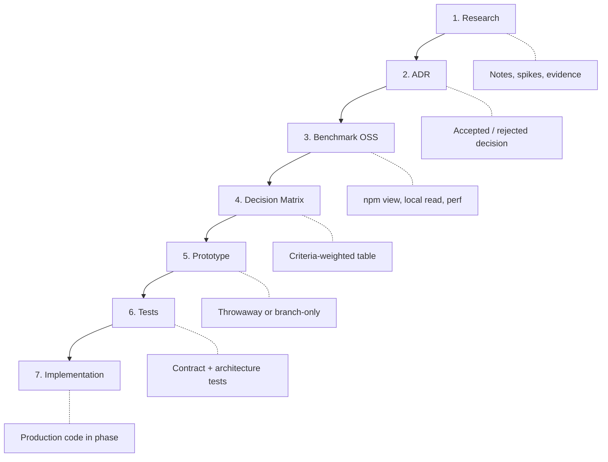
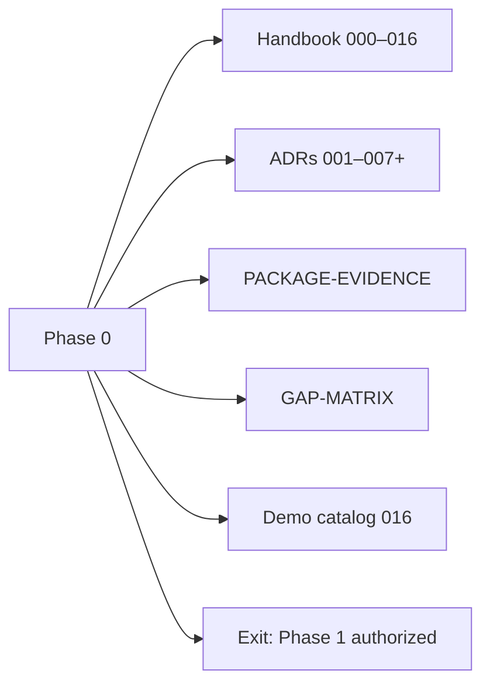
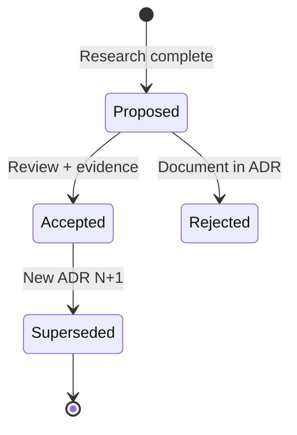

# 005 — Research Workflow

**Status:** Normative (Phase 0 handbook)  
**Audience:** Principal engineers, research agents, implementation agents  
**Last updated:** 2026-08-02  
**Related:** [003-project-constitution](./003-project-constitution.md) · [015-phases](./015-phases.md) · [docs/adrs/](./adrs/) · [GAP-MATRIX](./research/GAP-MATRIX.md)

---

## Purpose

This document defines **how Forge decides before it builds**: the mandatory research pipeline, ADR requirements, decision matrices, benchmark expectations, Phase 0 scope, and quality gates that gate implementation. Forge dogfoods **Research before Implementation** from day one—Phase 0 produces the handbook and ADRs before Phase 1 writes production code.

---

## Non-goals

This document does **not**:

- Replace individual research notes in `docs/research/`.
- Authorize skipping research for "small" features—if it touches ports, policy, or public API, research is required.
- Define implementation coding standards (see [003](./003-project-constitution.md)).
- List every Phase 1+ deliverable (see [015-phases](./015-phases.md)).

---

## The pipeline (mandatory)

Every **significant feature** or **technology adoption** follows this sequence. Not: Idea → Coding.



### Stage definitions

| Stage | Output | Owner | Merge to main? |
|-------|--------|-------|----------------|
| **Research** | Markdown note in `docs/research/` | Research agent | Yes (docs only) |
| **ADR** | `docs/adrs/NNN-*.md` using [template](./adrs/000-template.md) | Principal engineer | Yes, when accepted |
| **Benchmark OSS** | Version pins, API surface notes ([PACKAGE-EVIDENCE](./research/PACKAGE-EVIDENCE.md)) | Research agent | Evidence in research or ADR |
| **Decision Matrix** | Options × criteria → recommendation | Principal engineer | In ADR or linked doc |
| **Prototype** | Throwaway spike proving feasibility | Implementation agent | **No** (or isolated branch) |
| **Tests** | Contract tests, architecture tests planned | Implementation agent | Test code with feature phase |
| **Implementation** | Production packages per [004](./004-architecture.md) | Implementation agent | Per phase gates |

**Significant feature** means any of: new port, new adapter, public API change, policy model change, company loader behavior, compiler IR node kind, or new vendor dependency.

---

## Phase 0: research-only

Phase 0 **does no production implementation**. Its sole responsibility is research and specification artifacts.



### Phase 0 mandatory research topics

From RAW north star—each produces research note + ADR candidate:

| Topic | Output artifact | ADR status |
|-------|-----------------|------------|
| LangGraph | Research note + engine evaluation | [ADR-002](./adrs/002-workflow-engine.md) Accepted |
| LangSmith | Observability adapter evaluation | [ADR-006](./adrs/006-observability.md) Accepted |
| BullMQ | Queue port evaluation | [ADR-004](./adrs/004-queue.md) Accepted |
| Sandbox technologies | Docker, Firecracker, Testcontainers | [ADR-003](./adrs/003-sandbox.md) Accepted |
| Firecracker | Deep dive — prod defer | In ADR-003 |
| Testcontainers | CI strategy | [ADR-003](./adrs/003-sandbox.md) |
| MCP | Skill/tool boundary | ADOPT-LATER in PACKAGE-EVIDENCE |
| A2A | Interop horizon | Research note |
| ACPX | Mesh transport | Defer; never public |
| SimPill / `@simpill/acp-llm-cli` | Provider harness | [ADR-005](./adrs/005-provider.md) Accepted |
| Vercel AI SDK | Model I/O layer | PACKAGE-EVIDENCE ADOPT |
| AI Elements | UI building blocks | ADOPT-LATER |
| OpenTelemetry | Telemetry substrate | [ADR-006](./adrs/006-observability.md) Accepted |
| Open Policy Agent | Policy engine | [ADR-007](./adrs/007-policy.md) Accepted |
| OpenFeature | Feature flags | [ADR-007](./adrs/007-policy.md) — flags only |
| Monorepo layout | Workspace structure | [ADR-001](./adrs/001-monorepo-layout.md) Accepted |
| Company customization | forge vs forge.gusto | [016 research](./research/016-company-customization-and-demos.md) |
| Architecture / compiler / runtime | Layer model | [004 research](./research/004-006-007-architecture-runtime-compiler.md) |

### Phase 0 explicit non-deliverables

- No production workflow compiler
- No published npm packages
- No real Gusto production credentials
- No UI product
- No temporary core forks for Gusto
- No "we'll ADR later" merges of vendor code into public packages

### Phase 0 exit criteria

**Documents**

- [ ] Handbook `000`–`016` drafts at reviewable quality
- [ ] `MASTER_SPEC.md` skeleton linking all docs
- [ ] [003-project-constitution](./003-project-constitution.md) — full list + never-build
- [ ] [016-demo-scenarios](./016-demo-scenarios.md) catalog with acceptance checklists
- [ ] ADR-001 through ADR-007 accepted
- [ ] [GAP-MATRIX](./research/GAP-MATRIX.md) complete

**Decision artifacts**

- [ ] Decision matrix per adopted technology
- [ ] [PACKAGE-EVIDENCE](./research/PACKAGE-EVIDENCE.md) with npm/local verification
- [ ] Every ADR has alternatives + consequences

**Validation spikes (throwaway)**

- [ ] Minimal LangGraph hello workflow behind port (not merged as product)
- [ ] Zod v4 boundary parsing spike for manifests
- [ ] Policy deny path spike — prompt cannot escalate
- [ ] Dual-company load design validation (Acme + Gusto manifests)

**Quality**

- [ ] No planned `forge` package depends on `forge.gusto`
- [ ] Open questions list with owners
- [ ] Implementation agent can start Phase 1 from handbook alone

### Phase 0 demo

Phase 0 demo is **documentation walkthrough**, not running code:

- Walkthrough Acme vs Gusto separation (diagram)
- Tabletop policy > prompt sequence
- Review ADR stack with stakeholder

### Phase 0 quality gates

- ADR completeness checklist (all sections in template)
- Constitution + never-build reviewed
- **No implementation PRs merged**

---

## ADR requirements

### When an ADR is required

- New vendor dependency in any package
- New port or material port semantic change
- Public API surface change
- Policy/auth model change
- Monorepo layout change
- Superseding a constitution rule

### ADR template ([000-template](./adrs/000-template.md))

Every ADR must include:

```markdown
# ADR-NNN: Title
- Status: Proposed | Accepted | Superseded
- Date: YYYY-MM-DD
- Evidence: docs/research/…

## Context
## Decision
## Consequences
## Alternatives considered
## References
```

### ADR lifecycle



| Status | Meaning |
|--------|---------|
| **Proposed** | Under review; do not implement |
| **Accepted** | Binding; cite as ADR-NNN in specs |
| **Superseded** | Historical; follow replacement ADR |

### Numbering convention

- `ADR-001` … sequential in `docs/adrs/`
- Reference in handbook as **ADR-001**, not "monorepo ADR"
- Cross-link from [000-overview](./000-overview.md) ADR table

### Current accepted ADRs (Phase 0 baseline)

| ID | Title |
|----|-------|
| ADR-001 | Monorepo layout |
| ADR-002 | Workflow engine (LangGraph behind port) |
| ADR-003 | Sandbox strategy |
| ADR-004 | Queue (BullMQ behind port) |
| ADR-005 | Provider SDK (`@simpill/acp-llm-cli`) |
| ADR-006 | Observability substrate |
| ADR-007 | Policy engine (OPA Wasm) |

---

## Decision matrix template

Use for each technology research thread:

| Criterion | Weight | Option A | Option B | Option C |
|-----------|--------|----------|----------|----------|
| Abstraction leak risk | High | | | |
| TS / monorepo fit | High | | | |
| HITL / checkpoint story | High | | | |
| OSS maturity | Medium | | | |
| Operability | Medium | | | |
| Team familiarity | Low | | | |
| **Weighted score** | | | | |

**Recommendation:** …  
**Revisit trigger:** … (e.g., "LangGraph interrupt API breaking change")

Store matrices in research notes or ADR appendices. [GAP-MATRIX](./research/GAP-MATRIX.md) tracks RAW topic → artifact → handbook owner.

---

## Benchmark and evidence standards

### PACKAGE-EVIDENCE requirements

For each candidate dependency ([PACKAGE-EVIDENCE](./research/PACKAGE-EVIDENCE.md)):

| Field | Required |
|-------|----------|
| Package name + version | `npm view` or local read date |
| Decision | ADOPT / ADOPT-LATER / DEFER / REJECT |
| Adapter package | Which `@forge/adapters-*` may import |
| Public exposure | Must be **never** for engines/providers |
| Peer dependency conflicts | e.g., acp-llm-cli Zod v3 peer vs Forge Zod v4 |

### Provider harness (locked)

**`@simpill/acp-llm-cli`** ([github.com/SkinnnyJay/acp-llm-cli](https://github.com/SkinnnyJay/acp-llm-cli)) is the Forge provider harness per ADR-005:

- Install via git URL until npm publish
- Only `adapters-provider-*` may import
- Wire `IPermissionHandler` to Forge PolicyPort + ApprovalPort
- ACPX remains optional private mesh—not the Provider SDK

### Benchmark spikes

| Spike | Proves | Merge? |
|-------|--------|--------|
| LangGraph behind GraphEnginePort | HITL interrupt maps to approval | No |
| OPA Wasm deny path | Prompt cannot override | No (test patterns yes) |
| BullMQ job DTO roundtrip | Zod boundary | No |
| acp-llm-cli Claude CLI | ProviderPort feasibility | Adapter only in Phase 2 |

Spikes live on branches or `docs/research/spikes/`—never as production shortcuts.

---

## Phase model (research gates)

Every phase **after Phase 0** ends with four sections in [015-phases](./015-phases.md):

1. **Deliverables**
2. **Demo**
3. **Quality Gates**
4. **Exit Criteria**

Example (Phase 2 sketch):

```
Deliverables
  ✓ Provider abstraction
  ✓ Sandbox abstraction
  ✓ Workflow compiler skeleton

Demo
  Run two providers (Claude + mock)
  Resume a workflow

Quality Gates
  ✓ Unit tests
  ✓ Architecture tests
  ✓ Performance thresholds
  ✓ Security scan

Exit Criteria
  All gates pass
  Documentation updated
  ADRs written
```

Research workflow applies **within** phases too: a Phase 4 policy feature still needs ADR if it changes PolicyPort contract.

---

## Normative rules

1. **No production code before Phase 0 exit** — constitution [003](./003-project-constitution.md).
2. **No vendor in public package without ADR** — even devDependencies.
3. **Research notes are inputs; ADRs are decisions** — handbook cites ADRs, not drafts.
4. **Prototypes are disposable** — no "temporary" production paths.
5. **Benchmark before ADOPT** — PACKAGE-EVIDENCE or equivalent.
6. **Decision matrix before Accept** — alternatives documented.
7. **Tests planned before Implementation** — contract tests for ports.
8. **Gap matrix updated** — [GAP-MATRIX](./research/GAP-MATRIX.md) when RAW topic closes.

---

## Rationale

### Why research-first?

Implementation agents optimize locally. Without ADRs, they re-decide LangGraph vs Temporal, expose BullMQ "for debugging," or embed Gusto logic "temporarily." Phase 0 cost is smaller than revert cost.

### Why dogfood the pipeline?

Forge automates research → decision → execution workflows for customers. Using the same pipeline for Forge itself validates the model and produces real artifacts (this handbook).

### Why throwaway prototypes?

Prototypes prove feasibility without creating production debt. Merged spikes become undeletable coupling ([003](./003-project-constitution.md) never-build).

---

## Alternatives considered

| Alternative | Why rejected |
|-------------|--------------|
| Code first, document later | Vendor leaks; fork pressure |
| Single mega-ADR | Unreviewable; poor ownership |
| Skip matrix for "obvious" choices | Hidden bias; no revisit triggers |
| Permanent spike directories in packages | Becomes production |
| Research in issues only | Not versioned with handbook |

---

## Roles and responsibilities

| Role | Responsibility |
|------|----------------|
| **Research agent** | Notes, evidence, PACKAGE-EVIDENCE updates |
| **Principal engineer** | ADR authorship, matrix, Accept/Reject |
| **Implementation agent** | Prototype, tests, phase implementation |
| **Reviewer** | Constitution + ADR compliance on PR |

---

## Open questions (track in Phase 0)

From [GAP-MATRIX](./research/GAP-MATRIX.md) and company research:

| Question | Blocker for | Owner |
|----------|-------------|-------|
| AI SDK major pin alignment | Provider adapter Phase 2 | Platform |
| OPA Wasm latency budget | Phase 4 policy | Security |
| Firecracker self-host vs managed | Post-MVP sandbox | Infra |
| Gusto USP domain naming | Workflow nouns only | Gusto stakeholder |
| acp-llm-cli Zod v3 peer vs Forge v4 | ADR-005 adapter boundary | Platform |
| Hot-reload company packages | Ops model | Platform |

Unresolved questions do **not** block Phase 0 exit if documented with owner and revisit phase.

---

## Acceptance criteria

Research workflow doc is **accepted** when:

- [ ] Pipeline Research → … → Implementation is diagrammed and defined.
- [ ] Phase 0 scope, non-deliverables, and exit criteria are explicit.
- [ ] ADR template and lifecycle documented.
- [ ] Decision matrix template provided.
- [ ] PACKAGE-EVIDENCE and benchmark standards linked.
- [ ] ADR-001–007 listed as baseline.
- [ ] Phase 0 demo is doc walkthrough (not code).
- [ ] Aligns with constitution Research before Implementation rule.

Phase 0 **complete** when exit criteria checklist in this document is satisfied and principal engineer signs Phase 1 authorization in [015-phases](./015-phases.md).

---

## Quick reference: starting a new feature

1. **Search** existing ADRs and research—do not duplicate.
2. **Write** research note if gap exists.
3. **Benchmark** candidates; update PACKAGE-EVIDENCE.
4. **Fill** decision matrix.
5. **Open** ADR (Proposed → Accepted).
6. **Spike** if uncertainty remains (throwaway).
7. **Plan** tests in phase deliverable.
8. **Implement** only after Accept + phase assignment.
9. **Update** handbook if architecture or constitution affected.

---

## Changelog

| Date | Change |
|------|--------|
| 2026-08-02 | Initial research workflow from RAW + GAP-MATRIX + Phase 0 research |
