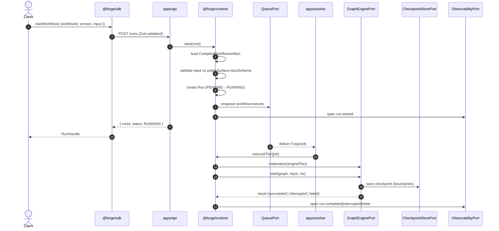
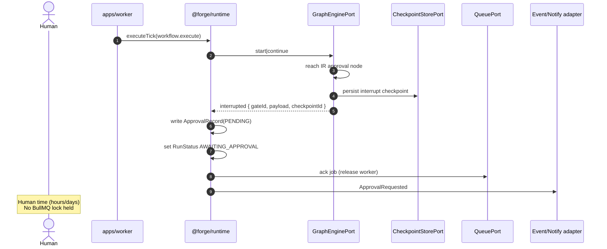
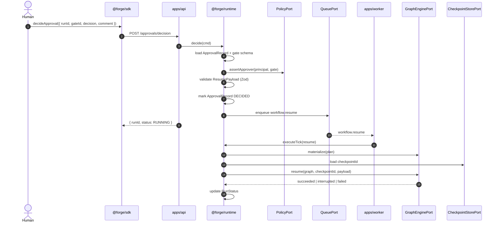
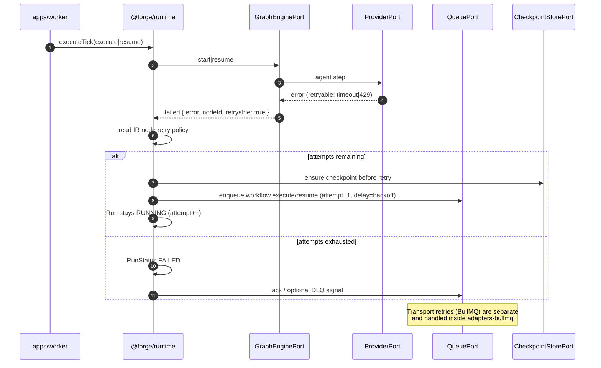

# 006 — Runtime

**Status:** Handbook (normative)  
**Date:** 2026-08-02  
**Related ADRs:** [002-workflow-engine](./adrs/002-workflow-engine.md), [003-sandbox](./adrs/003-sandbox.md), [004-queue](./adrs/004-queue.md), [005-provider](./adrs/005-provider.md)  
**Principles:** Deterministic Infrastructure. Intelligent Execution. · Humans own the final decision. · Adapters at every boundary.

---

## 1. Purpose

The Forge **runtime** is the stateful orchestration layer that executes compiled workflow artifacts. It owns run lifecycle, durable checkpoints, human approval records, retry enforcement, and port coordination. It does **not** parse manifests, lower graphs, or expose vendor engines.

Authors compile workflows once; operators start and resume runs through `@forge/sdk`. The runtime wires **ports** — never LangGraph, BullMQ, Claude, ACPX, or Docker types — to adapters configured at composition roots (`apps/api`, `apps/worker`).

---

## 2. Runtime vs compiler

| Concern | Compiler (`007`) | Runtime (this doc) |
|---------|------------------|---------------------|
| Parse/validate manifests | ✅ | ❌ loads sealed artifact |
| Build Forge IR, lower to `EnginePlan` | ✅ | ❌ |
| Fingerprint artifact | ✅ | lookup by `workflowVersionId` |
| LLM / tool execution | ❌ | ✅ via `ProviderPort` |
| Queue enqueue/dequeue | ❌ | ✅ via `QueuePort` |
| Checkpoint read/write | ❌ | ✅ via `CheckpointStorePort` |
| Approval records | ❌ | ✅ first-class |
| Retry / timeout enforcement | declares in IR | enforces at execution |
| Policy capability checks | static required-capability set | enforce before gated steps |
| Side effects / I/O | **forbidden** (pure) | expected |
| Determinism | **must be pure** | infra deterministic; agent steps non-deterministic |

### Runtime invariants

1. Never execute an unsealed or unfingerprinted artifact in production mode.
2. Never let provider output mutate control flow past a deterministic gate without re-entering typed validation.
3. Never let prompts grant capabilities — `PolicyPort` decides.
4. Human approval gates are interruptible wait-states, not best-effort callbacks.
5. Workers **must not** hold queue locks across human time — checkpoint, ack, release worker, resume via a new job.

---

## 3. Topology

```
Client → @forge/sdk → apps/api → @forge/runtime
                                      │
                    ┌─────────────────┼─────────────────┐
                    ▼                 ▼                 ▼
              QueuePort        GraphEnginePort   CheckpointStorePort
                    │                 │                 │
                    ▼                 ▼                 ▼
            adapters-bullmq   adapters-langgraph  adapters-checkpoint
                    │
                    ▼ Redis
              apps/worker (N replicas)
                    │
                    └── Runtime.executeTick → GraphEnginePort.start|resume
```

**Composition roots** (`apps/api`, `apps/worker`, integration tests) are the only places that bind concrete adapters. Runtime receives ports via constructor injection:

- `GraphEnginePort`
- `QueuePort`
- `CheckpointStorePort`
- `ApprovalPort` (runtime-owned records; may delegate notify adapters)
- `ProviderPort`
- `SandboxPort`
- `PolicyPort`
- `ObservabilityPort`
- `ClockPort`, `IdPort` (testability)

---

## 4. Core concepts

| Concept | Definition |
|---------|------------|
| **Run** | One execution instance of a sealed `workflowVersionId` |
| **Checkpoint** | Durable snapshot at a well-defined boundary (node completion or interrupt) |
| **Approval gate** | IR node that interrupts until a human decision arrives |
| **Resume payload** | Typed decision + optional commentary, Zod-validated |
| **Approval record** | Runtime entity: status, approvers, deadlines, audit trail |
| **ForgeJob** | Zod-validated queue DTO — never a BullMQ `Job` in domain code |

Approvals are **not** "LangGraph interrupt exposed to users." Operators see Forge approval APIs; the LangGraph adapter maps interrupt ↔ gate internally.

---

## 5. Run state machine

```
PENDING → RUNNING → AWAITING_APPROVAL → RUNNING → SUCCEEDED
                 ↘ FAILED
                 ↘ CANCELLED
                 ↘ (retrying: stays RUNNING, attempt++)
```

| Status | Meaning |
|--------|---------|
| `PENDING` | Run created; execute job not yet picked up |
| `RUNNING` | Worker actively executing or awaiting transport retry |
| `AWAITING_APPROVAL` | Durable interrupt; **no worker lock held** |
| `SUCCEEDED` | Terminal; output validated against artifact `outputSchema` |
| `FAILED` | Terminal; structured error code + node context |
| `CANCELLED` | Terminal; explicit cancel or policy timeout |

`AWAITING_APPROVAL` is first-class durable state persisted in the run store (Postgres preferred). Process restart must not lose pending approvals.

---

## 6. Port responsibilities

### 6.1 `GraphEnginePort`

Opaque graph execution behind `EnginePlan` (see `007`). Runtime never inspects LangGraph structures.

```ts
interface GraphEnginePort {
  materialize(plan: EnginePlan): Promise<MaterializedGraph>;
  start(
    graph: MaterializedGraph,
    input: unknown,
    ctx: RunContext
  ): Promise<EngineExecutionResult>;
  resume(
    graph: MaterializedGraph,
    checkpointId: CheckpointId,
    payload: ResumePayload
  ): Promise<EngineExecutionResult>;
}
```

`EngineExecutionResult` is a discriminated union:

- `succeeded` — final output payload
- `interrupted` — `{ gateId, checkpointId, approvalPayload }`
- `failed` — `{ error, nodeId, retryable }`

Implementation: `@forge/adapters-langgraph` (ADR-002). Checkpointer stays inside the adapter; runtime uses `CheckpointStorePort` for Forge-level checkpoint metadata.

### 6.2 `QueuePort`

BullMQ is **transport + worker scheduling**, not the workflow engine (ADR-004).

```ts
type ForgeJob =
  | { type: 'workflow.execute'; runId: RunId; workflowVersionId: WorkflowVersionId; attempt: number }
  | { type: 'workflow.resume'; runId: RunId; checkpointId: CheckpointId; resume: ResumePayload; attempt: number }
  | { type: 'workflow.cancel'; runId: RunId };

interface QueuePort {
  enqueue(job: ForgeJob, opts?: EnqueueOptions): Promise<JobId>;
  subscribe(handler: (job: ForgeJob, ack: Ack) => Promise<void>): Promise<void>;
}
```

Workers validate every payload with Zod `safeParse` before calling runtime. BullMQ types never appear outside `@forge/adapters-bullmq`.

**Critical rule:** On `interrupted` (approval gate), runtime **acks the job and releases the worker** before human time begins. Resume is a separate `workflow.resume` job.

### 6.3 `CheckpointStorePort`

Forge-level checkpoint metadata and listing; engine blobs remain adapter-internal.

```ts
interface CheckpointStorePort {
  save(record: CheckpointRecord): Promise<CheckpointId>;
  load(id: CheckpointId): Promise<CheckpointRecord>;
  listByRun(runId: RunId): Promise<CheckpointRecord[]>;
}
```

Public SDK exposes coarse progress via `getRun` — **not** raw checkpoint blobs or LangGraph state keys.

### 6.4 `ApprovalPort`

First-class human gate protocol. Not a leaky LangGraph abstraction.

```ts
type ApprovalDecision =
  | { kind: 'approve' }
  | { kind: 'reject'; reason: string }
  | { kind: 'edit'; patch: unknown }   // Zod-validated per gate schema
  | { kind: 'timeout' };

interface ApprovalPort {
  request(runId: RunId, req: ApprovalRequest): Promise<ApprovalId>;
  decide(approvalId: ApprovalId, decision: ApprovalDecision, principal: Principal): Promise<void>;
  getPending(runId: RunId): Promise<ApprovalRecord[]>;
}
```

Runtime flow when engine hits an approval IR node:

1. Engine returns `interrupted` with gate id + rendered payload + `checkpointId`.
2. Runtime persists checkpoint reference, creates `ApprovalRecord` (`PENDING`), sets run `AWAITING_APPROVAL`.
3. Runtime **acks queue job** — worker is free.
4. Optional notify adapter (Slack/email) — out of core.
5. Human calls `sdk.approvals.decide({ runId, gateId, decision, comment })`.
6. Runtime validates decision against gate schema + `PolicyPort.assertApprover(principal, gate)`.
7. Runtime enqueues `workflow.resume` with typed `ResumePayload`.
8. On reject: fail run or follow compiler-validated reject edge.

### 6.5 Other ports (summary)

| Port | Role at runtime |
|------|-----------------|
| `ProviderPort` | Agent/LLM sessions inside sandbox workspace (`008`) |
| `SandboxPort` | Disposable compute for tool/code steps (`010`) |
| `PolicyPort` | Capability allow/deny/require-approval before gated steps |
| `ObservabilityPort` | Run/step spans, structured audit events |

Provider and sandbox adapters are orchestrated by runtime; neither knows the other's vendor API.

---

## 7. Two retry layers

Never conflate transport retry with workflow retry in the public SDK.

| Layer | Owner | Triggers | Behavior |
|-------|-------|----------|----------|
| **Transport retry** | `QueuePort` / BullMQ | Redis blip, worker crash mid-ack, OOM | Bounded infra retry; handled inside `adapters-bullmq` |
| **Workflow retry** | Runtime + IR node policy | Provider timeout, 429, flaky tool | `maxAttempts`, `backoff`, `retryableErrors` on IR nodes; checkpoint before re-attempt |

Workflow retry may re-enqueue `workflow.execute` or `workflow.resume` with `attempt+1` and computed delay. SDK surfaces workflow-level failure reasons; transport exhaustion surfaces as `RunStatus.FAILED` with infra error codes.

---

## 8. Idempotency and at-least-once delivery

- `runId` is client-visible and unique.
- Enqueue idempotency keys: `execute:${runId}:${attempt}`, `resume:${runId}:${decisionId}`.
- Checkpoint writes are versioned; resume is safe under at-least-once delivery.
- Pre-interrupt nodes may re-run on resume (LangGraph semantics); compiler documents or enforces idempotency for side-effect nodes.

---

## 9. HITL patterns

| Pattern | Behavior | Typical use |
|---------|----------|-------------|
| **Approve / Reject** | Binary gate; reject routes to alternate edge or fail | Merge PR, send message, apply migration |
| **Edit then approve** | Human amends proposed payload; continue with edited state | PR description, ticket fields |
| **Tool allowlist interrupt** | Auto-approve low-risk tools; interrupt on sensitive tools | `bash`, network, `gh`, prod credentials |
| **Timeout policy** | Pending approval expires → `timeout` decision | SLA-bound BenOps workflows |
| **Async resume** | Start run → return handle → separate resume API | Production default |

### Engineering requirements

1. Durable checkpointer / run store — Postgres preferred.
2. Idempotent nodes before interrupt where side effects exist.
3. Approval records are audit events — who, when, decision, edit diff, policy id.
4. Policies before permissions — gates fire from policy + capability set, never prompt text.
5. TTL + escalation — background sweeper for stale interrupts.
6. Public API uses `ApprovalRequest` / `ApprovalDecision` Zod schemas only.

### Sandbox during long HITL waits

Default: require agent to commit/checkpoint to worktree branch before approval waits longer than a configured threshold; **destroy compute**; restore workspace from git on resume. See `010-sandbox.md` for isolation details.

| Strategy | When |
|----------|------|
| Keep sandbox alive | Short waits only (< minutes) |
| Snapshot + restore | When microVM backend supports it (Phase 2+) |
| Destroy + recreate from git | **Default** for long human waits |
| Hibernated worktree on host | Local/dev trusted environments |

---

## 10. Sequence diagrams

### 10.1 Start workflow



### 10.2 Hit approval gate



### 10.3 Resume after approval



### 10.4 Fail / retry



---

## 11. Dev vs production

| Mode | Queue | Provider | Checkpoint |
|------|-------|----------|------------|
| **Unit tests** | `InMemoryQueuePort` | `provider-mock` | in-memory |
| **Integration / CI** | Testcontainers Redis | `provider-mock` | Postgres (Testcontainers) |
| **Production** | BullMQ + Redis | `@simpill/acp-llm-cli` adapter | Postgres |

Same compiled artifact and runtime code path in all modes — adapter swap only at composition root.

---

## 12. What must never leak publicly

- LangGraph (`StateGraph`, checkpointer types, interrupt APIs)
- BullMQ (`Queue`, `Worker`, `Job`)
- Raw checkpoint blobs
- `EnginePlan` structure
- Provider-specific model IDs as required API enums

Always expose Forge concepts: `Run`, `Approval`, `Capability`, typed I/O schemas, `RunStatus`, deterministic error codes.

---

## 13. Acceptance criteria

When runtime implementation is complete for Phase 2+, **done** means:

1. **Port-only domain** — `@forge/runtime` imports no vendor packages; architecture tests pass.
2. **Start → succeed** — `sdk.workflows.start` with mock provider completes a compiled workflow end-to-end.
3. **Approval durability** — Kill worker during `AWAITING_APPROVAL`; decide later; resume succeeds without duplicate side effects on idempotent nodes.
4. **Worker release** — No BullMQ lock held while run is `AWAITING_APPROVAL` (observable via queue metrics / integration test).
5. **Two retry layers** — Workflow retry re-enqueues with backoff; transport retry handled inside BullMQ adapter without conflating SDK error codes.
6. **Idempotent resume** — Duplicate `workflow.resume` delivery does not double-apply side effects when gate schema requires `decisionId` dedup.
7. **Provider swap** — Same artifact runs with `provider-mock` and `@simpill/acp-llm-cli` adapter by DI change only.
8. **Policy gate** — Prompt text cannot bypass `PolicyPort` capability check before a gated tool step.
9. **Observability** — Every run emits `run.started`, step spans, and terminal span with structured status.
10. **Zod boundaries** — HTTP, queue payloads, and resume decisions validated with `safeParse`; invalid payloads fail closed with stable error codes.

---

## 14. Related documents

- [007 — Workflow Compiler](./007-workflow-compiler.md) — artifact production, IR, approval node compilation
- [008 — Provider SDK](./008-provider-sdk.md) — `ProviderPort`, event mapping, permission handler
- [009 — Plugin SDK](./009-plugin-sdk.md) — company packages that feed the compiler
- [010 — Sandbox](./010-sandbox.md) — disposable compute during agent steps
