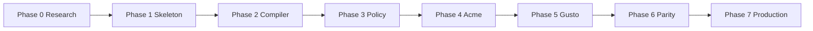

# 015 — Implementation Phases

**Status:** Handbook (normative)  
**Audience:** Implementation agents, tech leads, program owners  
**Related:** [013-testing](./013-testing.md) · [014-security](./014-security.md) · [016-demo-scenarios](./016-demo-scenarios.md) · [RAW](./research/RAW.md)  
**Research:** [016-company-customization-and-demos.md](./research/016-company-customization-and-demos.md)

---

> **This is the plan, not the state.** For what is actually built and what is
> not, see [STATUS.md](./STATUS.md), which is checked against the repository.
> Several exit criteria here are met by work that arrived in a different order
> than the phases describe.
>
> ### Where each phase stands, 2026-08-05
>
> | Phase | Exit criteria | Outstanding |
> |---|---|---|
> | −1 Vision validation | met | — |
> | 0 Research & specification | met | Several documents drifted from the code and have been corrected (007 §3–4, 009 §10, 010 §3/§10, 011 §3.2, ADR-005, ADR-007) |
> | 1 Monorepo skeleton | met | — |
> | 2 Providers, sandboxes & compiler | met | ADR-002's LangGraph engine is not built — see below. ADR-003 and ADR-005 are implemented, ADR-005 by amendment |
> | 3 Policies & human gates | met | ADR-007 implemented as OPA Wasm. The gate-bypass suite is green and the approval binding is proven across processes |
> | 4 Acme demo & operator UI | met | Playwright is not set up; the UI is covered by Vitest instead, and is inside the coverage floors rather than excluded from them |
> | 5 Gusto company package | met | G1–G5 pass; four scenarios are `todo` and held open by a test that goes red when the API stops ignoring `environment` |
> | 6 UI hardening, observability & G3–G5 | met | The north-star claim is demonstrated as **two deployments of one binary**, not one process serving two companies — see G5 and 009 §16 |
> | 7 Production readiness | **not started** | Load, chaos and DR are untouched. Durability, identity, isolation and telemetry are in place, which is the precondition |
> | 8 Connector extensions | **not started** | — |
>
> **ADR-002 is deliberately unmet.** The engine was to be LangGraph behind
> `GraphEnginePort`. `@forge/engine-memory` is the implementation instead, and
> the port remains so a vendor engine stays possible. The reason is that the
> engine now carries Forge's own semantics — sandbox scoping, verdict routing,
> arm pruning, and the data plane's short-circuit on pinned values — and those
> are the safety properties, not graph mechanics. Reimplementing them inside a
> vendor's execution model would move the invariants somewhere they cannot be
> enforced by this repository's tests. Revisit if a workflow needs something the
> in-repo engine genuinely cannot express.

## 1. Purpose

Forge is built **research-first** (Phase 0), then in incremental phases through production. Every phase after Phase 0 ends with four mandatory sections:

1. **Deliverables** — Artifacts that exist and are verifiable.
2. **Demo** — Something a human can watch or run that proves progress.
3. **Quality Gates** — RAW four gates plus Forge extensions (see below).
4. **Exit Criteria** — Objective conditions to start the next phase.

No phase is complete until all four sections are satisfied and documentation is updated.

---

## 2. Universal quality gates

Every implementation phase (1–7) includes:

### 2.1 RAW four gates

| Gate | Enforcement |
|------|-------------|
| **Unit tests** | `turbo test`; coverage floors on touched packages |
| **Architecture tests** | dependency-cruiser + eslint boundaries + arch Vitest |
| **Performance thresholds** | `budgets.json` p95 limits (compiler, gate latency, demo E2E) |
| **Security scan** | Gitleaks + Trivy (+ Semgrep); see [014-security](./014-security.md) |

### 2.2 Forge extensions (from Phase 2)

| Gate | When required |
|------|---------------|
| **Contracts** | Provider/plugin conformance green |
| **Acceptance** | Phase demo scenarios automated ([016](./016-demo-scenarios.md)) |

### 2.3 Exit checklist (copy per phase)

```text
Quality Gates
-------------
[ ] Unit: required suites pass; coverage floors met
[ ] Architecture: depcruise + eslint + arch tests pass
[ ] Performance: budgets.json not exceeded
[ ] Security: secret scan clean; CRITICAL/HIGH = 0 (or ADR waiver)
[ ] Contracts: conformance green (if applicable)
[ ] Acceptance: phase demo scenarios passing (if applicable)

Exit Criteria
-------------
[ ] All gates pass
[ ] Handbook + ADRs updated for this phase
[ ] Open questions triaged; blockers resolved or ADR-waived
[ ] Next phase entry criteria documented
```

---

## 3. Phase overview

| Phase | Name | Primary focus | Key demo |
|-------|------|---------------|----------|
| **−1** | Vision validation | Traceability from six-month outcome to every planned capability | Flagship V1 story review |
| **0** | Research & specification | ADRs, handbook, no product code | Doc walkthrough |
| **1** | Monorepo skeleton | Workspace, arch tests, ports stubs | `pnpm` boots; import rules fail |
| **2** | Providers, sandboxes, compiler | Mock + second provider; compile → run | Two providers; resume workflow |
| **3** | Policies & human gates | OPA fail-closed; approval port | A2 finance; A1 marketing approve |
| **4** | Acme demo org | Full `examples/acme`; UI MVP | A1–A5 green |
| **5** | Gusto company package | `forge.gusto`; benefits + BenOps | G1–G2 green |
| **6** | UI, observability, G3–G5 | LangSmith adapter; parity demo | G5 Acme vs Gusto |
| **7** | Production readiness | Hardening, SBOM, load, chaos | Production checklist |
| **8** | Connector extensions | Jira, Slack, Buzz transport adapters | Same workflow through each intake |

Scenario-to-phase mapping: [016-demo-scenarios](./016-demo-scenarios.md) § “Phase introduced.”

---

## Phase −1 — Vision Validation

**Scope:** No runtime code. Prove the product identity and make every planned capability traceable to a six-month user outcome.

### Deliverables

- `017-vision-validation.md` with the six-month assertions and flagship V1 story.
- Traceability matrix from package/dependency/feature to assertion, phase, acceptance scenario, and exit gate.
- ADR amendments for any topology/provider/security decision that conflicts with the flagship proof.

### Exit Criteria

- Every planned implementation item has a traceable outcome or is deferred.
- The flagship has happy, follow-up, denial, approval, restart, and recovery acceptance paths.
- Team agrees Forge owns execution/state/policy/evidence while clients and connector extensions only trigger/translate/present.

---

## Phase 0 — Research & Specification

**Scope:** Research only. No production implementation. Dogfoods “Research before implementation.”

### Deliverables

- Handbook docs `000`–`016` at reviewable quality (this set).
- ADRs for monorepo, workflow engine, queue, sandbox, provider, observability, policy, plugin SDK (accepted or draft with alternatives).
- Project constitution + what-not-to-build list ([RAW](./research/RAW.md)).
- Demo scenario catalog with acceptance checklists ([016](./016-demo-scenarios.md)).
- Threat model draft ([014-security](./014-security.md)).
- Decision matrices per major technology ([TECH-STACK-RESEARCH](./research/TECH-STACK-RESEARCH.md)).
- `MASTER_SPEC.md` skeleton linking all handbook docs.

### Demo

- **Walkthrough:** Acme vs Gusto separation (diagram + ownership matrix).
- **Tabletop:** Policy > prompt sequence diagram — show prompt injection cannot escalate tools.

### Quality Gates

- ADR completeness checklist (port interface, forbidden imports, fail modes, alternatives).
- Constitution reviewed; no implementation PRs merged.
- Architecture dependency graph documented: `forge` ↛ `forge.gusto`.

### Exit Criteria

- All Phase 0 artifacts accepted by tech lead.
- Implementation agent can start Phase 1 from `MASTER_SPEC` + handbook alone.
- Open questions have owners and target phases.

---

## Phase 1 — Monorepo Skeleton

**Scope:** pnpm workspace, Turborepo, shared TS/Biome/Vitest, empty packages with port interfaces.

### Deliverables

- pnpm workspace at repo root; `packages/@forge/*` scaffold (`schema`, `runtime`, `compiler`, `policy`, `sdk`, `cli`).
- `apps/api`, `apps/worker` skeleton; `apps/ui` health page.
- dependency-cruiser + eslint boundaries configured.
- Vitest projects layout ([013-testing](./013-testing.md)).
- CI: lint, typecheck, unit smoke, gitleaks, license allowlist.
- `.env.sample`; no secrets in repo.

### Demo

- `pnpm install && pnpm build && pnpm test` succeeds.
- Introduce forbidden import in core → CI fails (live demo of arch gate).

### Quality Gates

- **Unit:** smoke tests per package.
- **Architecture:** forbidden import rules active.
- **Performance:** baseline compile budget recorded (empty compiler stub).
- **Security:** Gitleaks clean; license allowlist pass.

### Exit Criteria

- All gates pass.
- ADR-001 monorepo layout implemented.
- Port interfaces documented in package READMEs / handbook cross-links.

---

## Phase 2 — Providers, Sandboxes & Compiler

**Scope:** Workflow compiler skeleton; mock provider + one alternate; sandbox port; compile → queue → run.

### Deliverables

- `@forge/compiler` — manifest → IR golden tests.
- `@forge/provider` + mock provider; second provider (e.g. alternate mock or Claude adapter behind flag).
- `@forge/sandbox` port + Docker Testcontainers integration.
- `@forge/provider-conformance` suite; mock passes.
- Resume/checkpoint via workflow engine adapter (LangGraph internal).
- OTEL: `forge.run.start|end`, `forge.node.*` spans.
- Testcontainers CI job (Redis; Postgres if checkpointer).

### Demo

- Run workflow on **mock provider**; switch config to **second provider** — same IR, same outcome.
- **Resume** after simulated interrupt (pre-approval checkpoint).
- Traces visible in local OTEL collector.

### Quality Gates

- **Unit:** compiler golden + conformance tests.
- **Architecture:** core ↛ langgraph in public paths; adapter isolation strict.
- **Performance:** p95 compile < budget for fixture set (`budgets.json`).
- **Security:** Trivy scan on sandbox base image; no privileged Dockerfile.
- **Contracts:** provider conformance green.
- **Acceptance:** compiler idempotence + provider switch test.

### Exit Criteria

- All gates pass.
- ADRs for engine, sandbox, provider marked implemented.
- Phase 3 entry: policy port interface stable.

---

## Phase 3 — Policies & Human Gates

**Scope:** OPA Wasm policy engine; approval port; parameter-bound gates; fail closed.

### Deliverables

- `@forge/policy` — OPA Wasm behind `PolicyPort`; default deny.
- `@forge/approvals` — durable gate service; checkpoint integration.
- Policy packs in examples (illustrative).
- Integration tests: prompt cannot override policy; gate FSM tests.
- OTEL: `forge.policy.decide`, `forge.approval.*`.
- Automated prompt-injection / gate-bypass suite (initial).

### Demo

- **A2 Finance:** recommendation shown; payment blocked without approval; audit trail.
- **A1 Marketing (API path):** approve → side effect; reject → no side effect.
- Policy error → deny (fail closed live demo).

### Quality Gates

- **Unit:** policy mapper + gate FSM exhaustive tests.
- **Architecture:** policy ↛ prompt package for authz; OpenFeature cannot widen capabilities.
- **Performance:** p95 policy decision < budget; gate open latency recorded.
- **Security:** gate-bypass suite green; approval binding tests.
- **Acceptance:** A1 + A2 API-level acceptance tests.

### Exit Criteria

- All gates pass.
- ADR-007 policy implemented.
- UI team can integrate against stable approval SDK DTOs.

---

## Phase 4 — Acme Demo Organization & Operator UI

**Scope:** `examples/acme` full package; approval inbox + run inspector; A1–A5 acceptance.

### Deliverables

- `examples/acme` — domains: marketing, finance, design, engineering.
- Company loader; plugin SDK v1 ([009-plugin-sdk](./research/016-company-customization-and-demos.md)).
- `apps/ui` — approval inbox + run inspector ([012-ui](./012-ui.md)).
- Playwright suite for A1–A5.
- Demo console (scenario launcher).
- ZAP baseline on UI (initial).

### Demo

- **A1** end-to-end in UI with mock provider.
- **A4** resume-after-approval in UI.
- **A5** marketing + engineering back-to-back, single runtime.
- Stakeholder demo: Acme four domains in one session.

### Quality Gates

- **Unit:** acme manifest validation tests.
- **Architecture:** `examples/acme` → public SDK only; core ↛ acme.
- **Performance:** demo E2E time budget per scenario.
- **Security:** ZAP baseline; CSRF on approve; CSP headers.
- **Acceptance:** A1–A5 Playwright/API green.

### Exit Criteria

- All gates pass.
- Acme proves generic framework without company fork.
- Gusto package can start against stable company loader contract.

---

## Phase 5 — Gusto Company Package (G1–G2)

**Scope:** `forge.gusto` sibling package; benefits + BenOps domains; company policies.

### Deliverables

- `forge.gusto/` — `forge.company.json`, domains `benefits`, `benops`, policy packs (PII, benefits-data).
- Gusto adapters (mock + stub real interfaces).
- G1 + G2 acceptance tests.
- Architecture test: `forge.gusto` ↛ core internals; core ↛ gusto.
- Gusto theme tokens for UI.

### Demo

- **G1 Benefits:** member inquiry → cited draft → regulated topic forces approval.
- **G2 BenOps:** triage → dry-run → partial approve executes subset only.
- Show zero Gusto imports in `packages/@forge/*`.

### Quality Gates

- **Unit:** Gusto policy pack tests.
- **Architecture:** dependency direction enforced.
- **Performance:** n/a new budgets unless regression.
- **Security:** tenant/fixture isolation; PII policy tests.
- **Acceptance:** G1 + G2 green.

### Exit Criteria

- All gates pass.
- Company extension model proven on real-shaped package.
- USP/R&D domains unblocked for Phase 6.

---

## Phase 6 — UI Hardening, Observability & G3–G5

**Scope:** LangSmith adapter; full OTEL taxonomy; USP, R&D, parity demos.

### Deliverables

- LangSmith adapter behind OpenFeature ([011-observability](./011-observability.md)).
- Redaction middleware production-ready.
- Gusto domains: `usp`, `r-and-d` with policy packs.
- **G3 USP**, **G4 R&D**, **G5 parity** acceptance tests.
- AI Elements evaluation (ADOPT-LATER) — spike only unless chat UX required.
- Full `forge.*` event taxonomy in dashboards (local/grafana).

### Demo

- **G4:** prod adapter call denied in R&D domain; experiment completes on mocks.
- **G5:** `forge run --company acme …` then `forge run --company gusto …` — same process, manifest diff shown in demo UI.
- Enable LangSmith flag — no core code changes.

### Quality Gates

- **Unit:** observability adapter + redaction tests.
- **Architecture:** UI still SDK-only; langsmith only in adapter package.
- **Performance:** span cardinality within budgets.
- **Security:** LangSmith sensitive field deny; R&D isolation tests.
- **Acceptance:** G3–G5 green.

### Exit Criteria

- All gates pass.
- North-star claim demonstrated: same runtime, different manifests + plugins.
- Production readiness workstream can start.

---

## Phase 7 — Production Readiness

**Scope:** Operability, supply chain attestation, load, chaos, runbooks.

### Deliverables

- SBOM generation (Syft) on every release artifact; Cosign signing (if ADR accepted).
- Load test: queue + worker under sustained runs.
- Chaos: kill sandbox mid-run → graceful fail + audit.
- Production OTEL collector deployment docs.
- SSO for approvers; step-up auth for high-risk (if IdP ADR accepted).
- Incident runbook; on-call alert rules.
- Optional: mutation/fuzz on compiler (Phase 7+).

### Demo

- Blue/green or staged deploy of worker + API.
- Simulated secret leak attempt → Gitleaks + runtime redaction block.
- Recovery drill: pending approvals survive worker restart.

### Quality Gates

- **Unit:** mutation/fuzz optional.
- **Architecture:** full fitness catalog from [013-testing](./013-testing.md).
- **Performance:** load test SLOs met (queue lag, p95 run duration).
- **Security:** full image scan + SBOM; vuln SLA; signed artifacts.
- **Acceptance:** smoke suite on staging; all A1–A5, G1–G5 on staging.

### Exit Criteria

- All gates pass.
- Production launch checklist signed.
- Post-launch: Phase 8+ features (MCP client, A2A, judges) via research workflow only.

---

## Phase 8 — Connector Extensions

> **Status: begun.** `@forge/intake` defines the canonical `WorkflowRequest`,
> the connector contract, and the conformance suite; `@forge/connector-slack`
> implements it and passes. The architecture check now refuses a connector
> import from anywhere but a composition root, which is this phase's second
> exit criterion enforced rather than promised. Not yet done: the intake route,
> a durable intake ledger, further connectors, and the outage property.

**Scope:** Add Jira, Slack, and Buzz only as thin intake/progress/artifact adapters after the CLI/API flagship workflow and canonical `WorkflowRequest` are production-evaluable.

### Deliverables

- Extension packages that verify external identity/signature, deduplicate, normalize to `WorkflowRequest`, and publish redacted progress/artifact summaries.
- Connector retry/backpressure policy and contract tests.
- `forge.buzz` end-to-end demo with strict core-to-extension dependency fitness tests.

### Demo

- CLI/API, Jira, Slack, and a signed Buzz room event start the same unchanged workflow and receive the same canonical artifact references.

### Exit Criteria

- Connector outage cannot lose canonical Forge workflow/audit state.
- Core contains no connector-specific imports, provider execution, policy decisions, or sandbox lifecycle code.

---

## 4. Explicit non-deliverables (all pre-production phases)

- No “temporary” core forks for Gusto or Acme.
- No real Gusto production credentials in repo.
- No prompts-as-permissions shortcuts for demo speed.
- No exposing LangGraph/BullMQ/Claude types in public SDK.

---

## 5. Phase dependency graph



Phases 4–6 assume prior phase gates; **do not skip** policy phase before side-effect demos.

---

## 6. Research workflow (applies to every phase)

For any significant feature within a phase:

```text
Research → ADR → Benchmark OSS → Decision Matrix → Prototype → Tests → Implementation
```

Not: Idea → Coding.

---

## 7. Open questions (phase routing)

| ID | Question | Target phase |
|----|----------|--------------|
| P-1 | Hot-reload company packages vs restart | Phase 4 ADR |
| P-2 | Multi-approver quorum v1? | Post Phase 7 |
| P-3 | Firecracker vs Docker-only for prod sandbox | Phase 2 ADR + Phase 7 |
| P-4 | USP domain exact naming at Gusto | Phase 6 stakeholder |

---

## 8. Handbook exit criteria

This document is **done** when:

- [ ] Every phase 0–7 has Deliverables, Demo, Quality Gates, Exit Criteria.
- [ ] [016-demo-scenarios](./016-demo-scenarios.md) maps each scenario to a phase.
- [ ] [013-testing](./013-testing.md) phase matrix aligns with §2–3 above.
