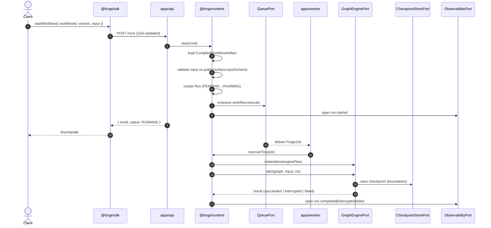
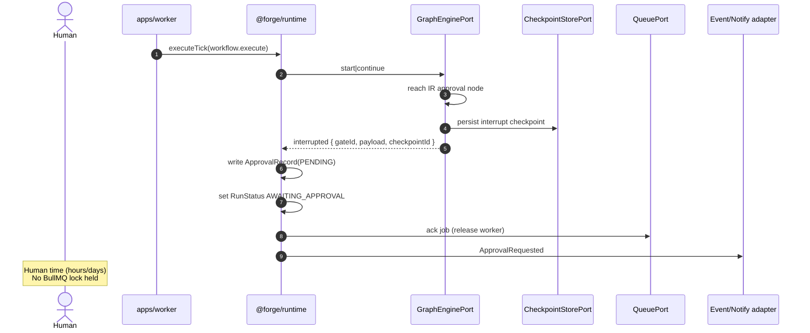
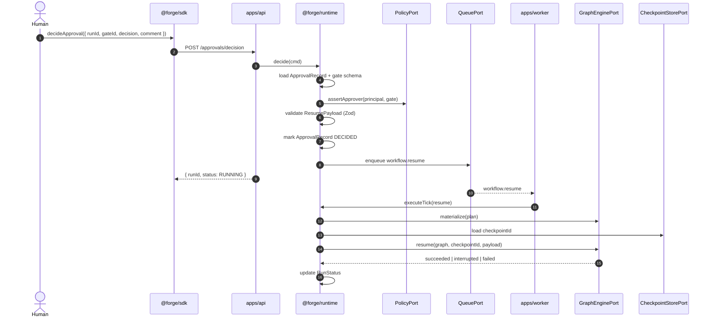
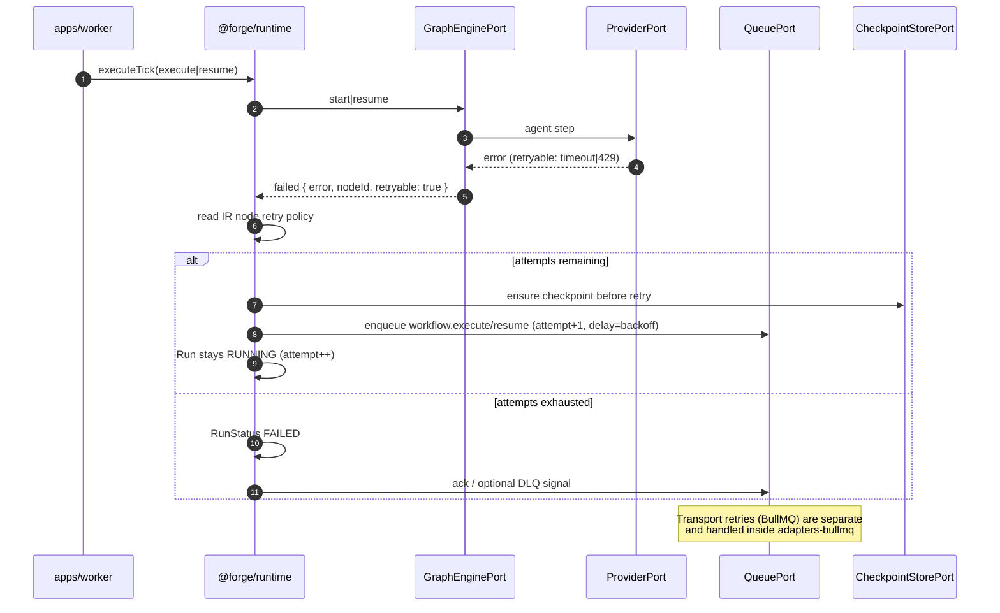

# Design Research: Architecture, Runtime, Workflow Compiler

**Feeds:** `004-architecture.md`, `006-runtime.md`, `007-workflow-compiler.md`  
**Status:** Research (pre-spec)  
**Date:** 2026-08-02  
**Principle anchors:** Compile. Don't Configure. · Deterministic Infrastructure. Intelligent Execution. · Adapters at Every Boundary · Ports & Adapters · Never expose LangGraph / BullMQ / Claude / ACPX

---

## Verdict

Forge is a **hexagonal TypeScript monorepo** with three hard seams:

1. **Authoring surface** — typed manifests (workflows, prompts, skills, policies).
2. **Compiler** — pure, deterministic lowering: Manifest → **Forge IR** → opaque **EnginePlan**.
3. **Runtime** — stateful orchestration over ports: queue, graph engine, checkpoint, provider, policy, observability.

LangGraph, BullMQ, Claude, and ACPX exist **only** inside adapter packages. The public SDK speaks Forge types exclusively. Approvals and checkpoints are first-class IR/runtime concepts, not vendor API leaks.

---

## 1. Proposed layered architecture (TS monorepo)

### 1.1 Layer model (dependency direction)

```
┌─────────────────────────────────────────────────────────────┐
│  Deployables (composition roots)                            │
│  apps/api · apps/worker · apps/ui · examples/*              │
└────────────────────────────▲────────────────────────────────┘
                             │ wires adapters → ports
┌────────────────────────────┴────────────────────────────────┐
│  Adapters (outbound / inbound tech)                         │
│  adapters-langgraph · adapters-bullmq · adapters-checkpoint │
│  adapters-provider-* · adapters-policy · adapters-otel      │
│  adapters-langsmith · adapters-acpx · adapters-sandbox      │
└────────────────────────────▲────────────────────────────────┘
                             │ implements
┌────────────────────────────┴────────────────────────────────┐
│  Application                                                │
│  runtime · compiler                                         │
└────────────────────────────▲────────────────────────────────┘
                             │ uses
┌────────────────────────────┴────────────────────────────────┐
│  Ports + IR (contracts)                                     │
│  ports · ir                                                 │
└────────────────────────────▲────────────────────────────────┘
                             │
┌────────────────────────────┴────────────────────────────────┐
│  Domain / Public contracts                                  │
│  types · manifest                                           │
└─────────────────────────────────────────────────────────────┘
          ▲
          │ imported by external consumers
┌─────────┴─────────┐
│  sdk · plugin-sdk │  ← only public libraries
└───────────────────┘
```

**Rule:** dependencies point **inward**. Adapters depend on ports; ports never depend on adapters. Public packages never depend on adapter or vendor packages.

### 1.2 Concrete package map

| Package | Visibility | Responsibility |
|---------|------------|----------------|
| `@forge/types` | **Public** | Branded IDs, `RunStatus`, error codes, shared Zod primitives |
| `@forge/manifest` | **Public** | `defineWorkflow`, `definePrompt`, `defineSkill`, `definePolicy`; authoring Zod schemas |
| `@forge/sdk` | **Public** | Thin client: start / resume / cancel / getRun / approvals |
| `@forge/plugin-sdk` | **Public** | Extension points for company plugins (skills, tools, config hooks) |
| `@forge/ir` | Internal | Forge Intermediate Representation node/edge taxonomy |
| `@forge/ports` | Internal | Port interfaces only (no impl) |
| `@forge/compiler` | Internal | Manifest → IR → EnginePlan; diagnostics; artifact fingerprint |
| `@forge/runtime` | Internal | Run lifecycle, approval records, retry policy application, port orchestration |
| `@forge/adapters-langgraph` | Internal | `GraphEnginePort` + IR→LangGraph lowering |
| `@forge/adapters-bullmq` | Internal | `QueuePort` over BullMQ/Redis |
| `@forge/adapters-checkpoint` | Internal | `CheckpointStorePort` (Redis/Postgres); wraps engine checkpointer |
| `@forge/adapters-provider-claude` | Internal | `ProviderPort` for Claude CLI / API |
| `@forge/adapters-provider-mock` | Internal | Deterministic mock provider for demos/tests |
| `@forge/adapters-policy` | Internal | `PolicyPort` (OPA or in-process evaluator) |
| `@forge/adapters-otel` | Internal | `ObservabilityPort` → OpenTelemetry |
| `@forge/adapters-langsmith` | Internal | Optional LLM-trace sink behind ObservabilityPort |
| `@forge/adapters-acpx` | Internal | Agent protocol adapter; never re-exported |
| `@forge/adapters-sandbox` | Internal | Disposable sandbox port impl |
| `apps/api` | Deployable | HTTP/control plane composition root |
| `apps/worker` | Deployable | Queue consumer composition root |
| `apps/ui` | Deployable | Operator UI (approvals, run inspector) |
| `examples/acme/*` | Example | Generic org demos |
| `examples/gusto/*` or `forge-gusto` | Example/ext | Company extension without forking core |

### 1.3 Suggested repo layout

```
forge/
├── apps/
│   ├── api/
│   ├── worker/
│   └── ui/
├── packages/
│   ├── types/
│   ├── manifest/
│   ├── sdk/
│   ├── plugin-sdk/
│   ├── ir/                 # private
│   ├── ports/              # private
│   ├── compiler/           # private
│   ├── runtime/            # private
│   └── adapters/
│       ├── langgraph/
│       ├── bullmq/
│       ├── checkpoint/
│       ├── provider-claude/
│       ├── provider-mock/
│       ├── policy/
│       ├── otel/
│       ├── langsmith/
│       ├── acpx/
│       └── sandbox/
├── examples/
│   ├── acme/
│   └── gusto/
├── docs/
└── tools/
    └── architecture/       # dependency-cruiser, eslint boundaries
```

### 1.4 DI / composition

- **Composition roots only** in `apps/api` and `apps/worker` (and tests).
- Prefer a small DI container (e.g. `typed-inject` or hand-rolled factory modules) — **composition over inheritance**, no service locator sprawl.
- Runtime receives ports via constructor injection: `QueuePort`, `GraphEnginePort`, `CheckpointStorePort`, `ProviderPort`, `PolicyPort`, `ObservabilityPort`, `ClockPort`, `IdPort`.
- Feature flags via `FeatureFlagPort` (OpenFeature adapter later); never scattered `process.env` checks in domain/runtime logic. Env = secrets only; config objects elsewhere.

### 1.5 Architecture fitness gates (must ship with 004)

- `dependency-cruiser` / ESLint boundaries:
  - `sdk|manifest|types|plugin-sdk` ↛ `adapters-*|compiler|runtime|ir` (sdk may use types+manifest only; plugin-sdk may use types+manifest+ports *interfaces* if needed — prefer types only).
  - No public package may import `langgraph`, `bullmq`, `@anthropic*`, `acpx`.
  - `compiler` ↛ network adapters; compiler may depend on `ir`, `manifest`, `ports` (compile-target interface only).
- Ban `any`; Zod v4 safeParse at every process boundary (HTTP, queue payload, sandbox IPC).

---

## 2. Runtime responsibilities vs compiler responsibilities

| Concern | Compiler | Runtime |
|---------|----------|---------|
| Parse/validate manifests | ✅ | ❌ (loads sealed artifact) |
| Resolve prompt/skill/policy refs | ✅ | ❌ (refs already bound) |
| Type-check step I/O contracts | ✅ | Re-validate payloads at boundaries only |
| Build Forge IR | ✅ | ❌ |
| Lower IR → EnginePlan | ✅ (via CompileTarget, see §3) | ❌ |
| Fingerprint / version artifact | ✅ | Lookup by `workflowVersionId` |
| LLM calls | ❌ | ✅ via `ProviderPort` |
| Queue enqueue/dequeue | ❌ | ✅ via `QueuePort` |
| Checkpoint write/read | ❌ | ✅ via `CheckpointStorePort` |
| Approval records | ❌ | ✅ first-class |
| Retry / timeout / circuit break | Declares policy in IR | Enforces policy |
| Policy capability checks | Static required-capabilities set | ✅ enforce before gated steps |
| Observability spans | Emits compile metrics | Emits run/step spans |
| Side effects / I/O | **Forbidden** (pure) | Expected |
| Determinism | **Must be pure** given inputs | Infra deterministic; agent steps non-deterministic |

### 2.1 Compiler invariants

1. Same manifest bytes + same compiler version → same artifact fingerprint.
2. No Redis, no HTTP, no LLM, no clock-dependent branching (timestamps only as metadata if needed, not control flow).
3. All failures are **diagnostics** with stable codes (`WF_UNKNOWN_REF`, `WF_CYCLE`, `WF_UNTYPED_EDGE`, …).

### 2.2 Runtime invariants

1. Never execute an unsealed / unfingerprinted artifact in production mode.
2. Never let provider output mutate control flow past a deterministic gate without re-entering typed validation.
3. Never let prompts grant capabilities — `PolicyPort` decides.
4. Human approval gates are interruptible wait-states, not best-effort callbacks.

### 2.3 Artifact cache

```
CompiledWorkflowArtifact {
  workflowId: WorkflowId
  workflowVersionId: WorkflowVersionId
  compilerVersion: string
  fingerprint: Sha256
  ir: ForgeIR                    // inspectable internally / for debugging UIs
  enginePlan: EnginePlan         // opaque; only langgraph adapter understands
  publicSurface: {               // what SDK/UI may show
    inputSchema: ZodTypeAny
    outputSchema: ZodTypeAny
    approvalGates: ApprovalGateSummary[]
    requiredCapabilities: CapabilityId[]
  }
}
```

Runtime loads artifact by version; workers warm-cache EnginePlan → live engine instance.

---

## 3. Manifest → graph engine without leaking engine types

### 3.1 Pipeline (Compile. Don't Configure.)

```
WorkflowManifest (Zod)
        │
        ▼
   Validate + resolve refs
        │
        ▼
   ForgeIR (engine-agnostic)
        │
        ▼
   CompileTargetPort.lower(ir)     ← implemented only in adapters-langgraph
        │
        ▼
   EnginePlan (opaque brand)
        │
        ▼
   CompiledWorkflowArtifact (sealed)
```

Authors **never** hand-wire LangGraph nodes. They declare typed workflow manifests; the compiler produces the graph.

### 3.2 Forge IR (sketch — taxonomy for 007)

Node kinds (discriminated union, Zod-validated):

| Kind | Deterministic? | Notes |
|------|----------------|-------|
| `input` | yes | Validates run input |
| `agent` | no | Calls `ProviderPort`; typed I/O schemas |
| `tool` | mostly | Skill/tool invocation; policy-gated |
| `transform` | yes | Pure mapped function / JSONLogic-like |
| `branch` | yes | Predicate on typed state |
| `parallel` | yes | Fan-out/fan-in barrier |
| `approval` | yes (wait) | Human gate; resume payload schema |
| `policy_check` | yes | Capability assertion |
| `sandbox` | infra | Run untrusted work in sandbox port |
| `output` | yes | Final typed result |

Edges carry `from`, `to`, optional condition id. Retry/timeout/backoff are **node policies**, not scattered config.

### 3.3 Opacity technique (opinionated)

Do **not** export LangGraph `StateGraph` types from any public or even shared runtime surface.

```ts
// @forge/ports — what runtime sees
export interface GraphEnginePort {
  materialize(plan: EnginePlan): Promise<MaterializedGraph>;
  start(graph: MaterializedGraph, input: unknown, ctx: RunContext): Promise<EngineExecutionResult>;
  resume(graph: MaterializedGraph, checkpointId: CheckpointId, payload: ResumePayload): Promise<EngineExecutionResult>;
}

// Opaque brand — constructible only inside adapters-langgraph
declare const EnginePlanBrand: unique symbol;
export type EnginePlan = { readonly [EnginePlanBrand]: true };
```

Implementation detail: `adapters-langgraph` holds a `WeakMap` or private module registry from `EnginePlan` → actual lowering data. Alternatively serialize plan as versioned JSON **understood only by that adapter**. Either way, `@forge/runtime` only passes `EnginePlan` through; it never inspects LangGraph structures.

### 3.4 Why IR (not thin LangGraph wrapper)

| Approach | Verdict |
|----------|---------|
| Public LangGraph config | **Reject** — violates north star |
| Manifest → LangGraph directly in compiler | Weak — couples compiler to vendor; hard to test lowering |
| **Manifest → IR → adapter lowering** | **Adopt** — swap/mock engine; fitness tests; compile purity |
| JIT IR→engine on every run | Acceptable for v0; prefer AOT artifact for prod |

**Recommendation:** AOT compile to artifact; worker materializes graph on demand with LRU cache keyed by fingerprint.

### 3.5 Public API surface for workflows

```ts
// authors write (public)
export const claimReview = defineWorkflow({
  id: 'benefits.claim_review',
  version: '1.2.0',
  input: ClaimInput,
  output: ClaimOutput,
  steps: [ /* typed step builders */ ],
});

// operators call (public SDK)
await forge.workflows.start({ workflowId, version, input });
// never: new StateGraph(), never: queue.add('langgraph-...')
```

---

## 4. Queue / worker boundary (BullMQ behind adapter)

### 4.1 Role of the queue

BullMQ is **transport + worker scheduling**, not the workflow engine.

| Layer | Owns |
|-------|------|
| QueuePort | Durable delivery of Forge job DTOs; concurrency; transport retries; DLQ |
| GraphEnginePort | Step graph execution, engine interrupts, engine-level checkpoints |
| Runtime | Mapping job ↔ run lifecycle; workflow-level retry policies from IR |

### 4.2 Job DTO (Zod at boundary)

```ts
// conceptual — lives in @forge/types or @forge/ports job schemas
type ForgeJob =
  | { type: 'workflow.execute'; runId; workflowVersionId; attempt }
  | { type: 'workflow.resume'; runId; checkpointId; resume: ResumePayload; attempt }
  | { type: 'workflow.cancel'; runId };
```

Workers validate with Zod safeParse before touching runtime. BullMQ `Job` type **never** appears outside `adapters-bullmq`.

### 4.3 QueuePort interface (sketch)

```ts
interface QueuePort {
  enqueue(job: ForgeJob, opts?: EnqueueOptions): Promise<JobId>;
  subscribe(handler: (job: ForgeJob, ack: Ack) => Promise<void>): Promise<void>;
  // moveToDlq, pause, stats — as needed
}
```

`adapters-bullmq` maps:

- Forge job type → BullMQ queue name / job name
- `EnqueueOptions.priority|delay|idempotencyKey` → BullMQ opts
- Transport retry ≠ workflow retry (see §4.5)

### 4.4 Process topology

```
Client → apps/api → Runtime.start → QueuePort.enqueue
                                         │
                                         ▼ Redis
                                         │
                              apps/worker (N replicas)
                                         │
                              Runtime.executeTick
                                         │
                              GraphEnginePort.start|resume
```

**Dev/test:** `InMemoryQueuePort` + `MockProvider` for parity without Redis. Production always queued so API and worker scale independently.

### 4.5 Two retry layers (Deterministic Infrastructure)

1. **Transport retry** (BullMQ): transient Redis blips, worker crash mid-ack, process OOM. Bounded, infra-level.
2. **Workflow retry** (IR node policy): model timeouts, 429s from provider, flaky tool. Declared on nodes (`maxAttempts`, `backoff`, `retryableErrors`). Runtime/engine enforces; may write checkpoint between attempts.

Never conflate them in the public SDK. SDK exposes workflow-level failure reasons; transport failures surface as `RunStatus.FAILED` with infra error codes after exhaustion.

### 4.6 Idempotency

- `runId` is client-visible and unique.
- Enqueue uses idempotency key `execute:${runId}:${attempt}` / `resume:${runId}:${decisionId}`.
- Checkpoint writes are versioned; resume is safe under at-least-once delivery.

---

## 5. Checkpoint / resume and human approval (first-class)

### 5.1 Concepts

| Concept | Definition |
|---------|------------|
| **Run** | One execution instance of a workflow version |
| **Checkpoint** | Durable snapshot at a well-defined boundary (node completion or interrupt) |
| **Approval gate** | IR node that interrupts until a human decision arrives |
| **Resume payload** | Typed decision + optional commentary/metadata, Zod-validated |
| **Approval record** | Runtime entity: status, approvers, deadlines, audit trail |

Approvals are **not** "LangGraph interrupt exposed to users." Users see Forge approval APIs; the adapter maps interrupt ↔ gate.

### 5.2 State machine (run)

```
PENDING → RUNNING → AWAITING_APPROVAL → RUNNING → SUCCEEDED
                 ↘ FAILED
                 ↘ CANCELLED
                 ↘ (retrying stays RUNNING with attempt++)
```

`AWAITING_APPROVAL` is a first-class durable state. The worker must **ack the job and stop** while waiting — do not hold a BullMQ lock across human time.

### 5.3 Approval flow (runtime rules)

1. Engine hits `approval` node → returns `EngineExecutionResult.interrupted` with gate id + rendered payload.
2. Runtime persists checkpoint id, creates `ApprovalRecord` (`PENDING`), sets run `AWAITING_APPROVAL`, emits domain event / OTel span.
3. Optional notify job (Slack/email) via adapter — not in core.
4. Human calls `sdk.approvals.decide({ runId, gateId, decision: 'approve'|'reject', comment })`.
5. Runtime validates decision against gate schema + policy (who may approve).
6. Enqueue `workflow.resume` with typed `ResumePayload`.
7. Worker materializes graph, `GraphEnginePort.resume(checkpointId, payload)`.
8. On reject: either fail run or follow IR-defined reject edge (compiler-validated).

### 5.4 Checkpoint store

- Port: `CheckpointStorePort.save|load|list`.
- LangGraph checkpointer remains **inside** `adapters-langgraph` / `adapters-checkpoint`.
- Public SDK can expose `getRun` with coarse progress + pending approvals — **not** raw checkpoint blobs or LangGraph state keys.

### 5.5 Humans own the final decision

- Preceding `agent` nodes may attach **recommendations** into the approval payload (typed field).
- Policy may require dual control / role checks.
- Prompts cannot approve. Providers cannot call `decideApproval` without a human-authn principal (enforced at API).

---

## 6. Sequence diagrams (Mermaid-ready)

### 6.1 Start workflow



### 6.2 Hit approval gate



### 6.3 Resume after approval



### 6.4 Fail / retry



---

## 7. Public SDK vs internal packages

### 7.1 Public (semver; company code may depend)

| Package | Allowed exports |
|---------|-----------------|
| `@forge/sdk` | `createForgeClient`, run APIs, approval APIs, typed errors |
| `@forge/types` | IDs, statuses, public error codes, shared schemas |
| `@forge/manifest` | `defineWorkflow` / `definePrompt` / `defineSkill` / `definePolicy` |
| `@forge/plugin-sdk` | Plugin registration helpers, skill handler types, extension config types |

**Explicitly not public:** anything that imports or re-exports LangGraph, BullMQ, Claude SDK shapes, ACPX, EnginePlan internals, IR mutators, Redis clients.

### 7.2 Internal (private packages / `"private": true`)

- `compiler`, `ir`, `runtime`, `ports`
- all `adapters-*`
- `apps/*` (deployables, not libraries)

Company extensions (**Extension over Replacement**) live in `examples/gusto` or a separate `forge-gusto` repo that depends only on public packages + plugin-sdk. They ship manifests, prompts, skills, policies, UI bindings — **not** forks of runtime.

### 7.3 Boundary checklist for specs

Never expose publicly:

- [ ] LangGraph (`StateGraph`, checkpointer types, interrupt APIs)
- [ ] BullMQ (`Queue`, `Worker`, `Job`)
- [ ] Claude-specific request/response types
- [ ] ACPX protocol types
- [ ] Provider-specific model IDs as required API (map via config/adapters)
- [ ] Raw checkpoint blobs
- [ ] EnginePlan structure

Always expose as Forge concepts:

- [ ] Workflow / Run / Approval / Capability
- [ ] Typed input/output schemas
- [ ] Run status enum
- [ ] Deterministic error codes

---

## Recommendations for the three target docs

### `004-architecture.md` should lock

- Layer diagram + package map + dependency rules
- Composition roots + DI policy
- Fitness tests / dependency-cruiser rules
- "What not to build / expose" constitution excerpt
- How examples/acme vs gusto extend without forking

### `006-runtime.md` should lock

- Run state machine
- Port list and responsibilities
- Queue vs engine vs workflow retry
- Checkpoint + approval as first-class
- Worker/API topology
- Idempotency and at-least-once handling
- Sequence diagrams §6.1–6.4

### `007-workflow-compiler.md` should lock

- Manifest schema principles (Zod v4)
- IR taxonomy and node policies
- Lowering pipeline + opaque EnginePlan
- Determinism / fingerprinting
- Diagnostics catalog
- Compile-time vs runtime validation split
- Test strategy: pure compiler unit tests + golden IR fixtures + adapter lowering tests

---

## Open ADRs (Phase 0 → before implementation)

| ADR | Question | Strawman |
|-----|----------|----------|
| ADR-ENG-001 | Graph engine choice | LangGraph JS behind `GraphEnginePort` |
| ADR-ENG-002 | IR serialization format | Versioned JSON + Zod; EnginePlan private to adapter |
| ADR-ENG-003 | Checkpoint persistence | Postgres for run/approval records; Redis/Postgres for engine checkpoints |
| ADR-ENG-004 | Queue backend | BullMQ + Redis; InMemory for tests |
| ADR-ENG-005 | Approval notification | Out-of-core adapter (Slack/email); core emits domain events |
| ADR-ENG-006 | Compile AOT vs JIT | AOT artifacts in prod; JIT allowed in ephemeral dev |
| ADR-ENG-007 | Multi-tenant queue isolation | Prefix queues by tenant/org id |

---

## Acceptance criteria (for later quality gates)

When 004/006/007 specs are written and implementation begins, "done" for this architecture slice means:

1. Public packages have zero dependency edges to vendor engines.
2. A workflow author can define a manifest with an approval gate without importing LangGraph.
3. Compiler is unit-testable with no Redis/LLM.
4. Same demo runs with `MockProvider` and Claude adapter by DI swap only.
5. Kill worker during `AWAITING_APPROVAL`; decide later; resume succeeds.
6. Architecture tests fail CI if BullMQ types leak into `@forge/sdk`.

---

## Alternatives considered (short)

| Alternative | Why rejected |
|-------------|--------------|
| Configure LangGraph in userland | Violates Compile. Don't Configure. |
| Temporal as primary engine | Heavier ops; revisit only if LangGraph HITL/checkpoint gaps force it |
| Sync in-process only (no queue) | Fails durable approval / scale; keep InMemory port for tests only |
| Expose interrupts as LangGraph API | Leaks vendor; couples UI/SDK |
| Compiler emits generated TS source committed to repo | Slow DX; prefer sealed artifacts + cache |

---

## Doc mapping summary

| Research § | Primary doc | Secondary |
|------------|-------------|-----------|
| §1 Layered packages | 004 | MASTER_SPEC |
| §2 Compiler vs runtime | 006, 007 | 004 |
| §3 Manifest→IR→EnginePlan | 007 | 004 |
| §4 Queue/worker | 006 | 004 |
| §5 Checkpoint/approval | 006 | 007 (IR node) |
| §6 Sequences | 006 | 004 appendix |
| §7 Public vs internal | 004 | 009 Plugin SDK |
